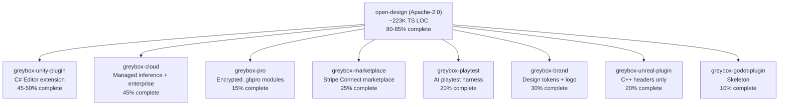

# Greybox Studio — Complete Codebase Analysis, Valuation & ROI Plan

**Date:** May 19, 2026  
**Analyst scope:** All 9 repositories, ~349,635 lines of source code  
**Previous docs superseded:** `VALUATION_AND_ROI_PLAN.md` (May 15), `GREYBOX_VALUATION_UPDATE_2026-05-18.md` (May 18)

---

## 0. Your Two Questions — Direct Answers

### Q1: Desktop app or web app?

**Hybrid, web-first.** But neither matters as much as the **Unity Editor plugin** — that is the moat.

| Surface | Role | Build now? |
|---|---|---|
| **Web SaaS** (Vercel + managed daemon) | Front door — distribution, analytics, collaboration | **Yes — primary** |
| **Electron desktop** (macOS + Windows) | Trust layer — "your code never leaves your laptop" | **Yes — keep shipping** |
| **Unity Editor plugin** | **The moat** — closed-source, paid, what a buyer pays for | **Yes — #1 priority** |

### Q2: How much can you sell this for?

| Stage | Realistic Sale Value |
|---|---|
| **Today, as-is** (~32% closed-source completion) | **$500K – $3M** (acqui-hire) |
| **After Tier-1 enhancements** (Unity v1 + Pro modules + cloud margin + brand) | **$15M – $80M** strategic |
| **Category-leader ceiling** (4–6 years, $20M–$50M ARR) | **$200M – $600M+** |

---

## 1. What You Actually Have — The Full Inventory

### 1.1 Nine-Repository Architecture

### 1.2 Module-by-Module Reality Check

| Module | LOC | Completeness | Shippable today? |
|---|---|---|---|
| `open-design/` | ~223K TS | **80–85%** | **Yes** — shippable as free product |
| `greybox-unity-plugin/` | ~5.2K C# | **45–50%** | **Partial** — PrefabBuilder works, but uses cube placeholders, no real mesh import |
| `greybox-cloud/` | ~33K TS | **45%** | **Partial** — inference proxy + license validation real; enterprise endpoints are reports, not enforcement |
| `greybox-pro/` | ~2.9K TS | **15%** | **No** — envelope format real, but 12 module payloads are not authored |
| `greybox-marketplace/` | ~8.6K TS | **25%** | **No** — checkout session builders real, payout execution is dead code |
| `greybox-playtest/` | ~3.6K TS | **20%** | **No** — personas exist, observer has no rules, tuner has no model |
| `greybox-brand/` | 119 files | **30%** | **Partial** — tokens emit, logo exists, no website/collateral |
| `greybox-unreal-plugin/` | ~1.7K C++ | **20%** | **No** — headers only |
| `greybox-godot-plugin/` | ~0.76K | **10%** | **No** — skeleton placeholder |

**Weighted closed-source completeness: ~32%**

### 1.3 The "Drops Directly on Unity" Claim — What Actually Exists

After reading every line of `game-engine-runtime.ts` (573 LOC), `unity-package-builder.ts` (304 LOC), `unity-sync.ts` (386 LOC), and the C# plugin:

| What works today | What doesn't work |
|---|---|
| `.gameview.json` → single `AGDSGameViewRuntime.cs` MonoBehaviour with terrain zones, sculpt patches, factions, tick advancement | No `.prefab` YAML emission |
| `.unitypackage` tar+gzip builder with GUID assignment and `.meta` files | No real mesh/FBX import (cubes as placeholders) |
| WebSocket sync hub supporting Unity/Unreal/Godot with latency budget guards | No `ScriptableObject` asset generation |
| Three-engine code generation (Unity C#, Godot GDScript, Unreal C++) | No Addressables labeling |
| Round-trip edit message normalization with path sanitization | No round-trip three-way merge implementation |
| Pro engine target injection into Unity packages | No MCP bridge dispatch logic |

**Honest characterization:** The current import is closer to "writes a JSON-driven script you still have to wire up yourself" than "drag and drop a level into Unity." The *infrastructure* is solid — the *content pipeline* is incomplete.

### 1.4 What the Open Core Actually Produces

| Surface | Output | Production-ready? |
|---|---|---|
| Playable concept | Single-file HTML game in sandboxed iframe | Prototype only |
| Mobile/desktop game UI | HTML with device frames | Mockup |
| Game HUD system | HTML | Mockup |
| Level design board | HTML diagram | Diagram |
| Game art bible | Markdown DESIGN.md + swatch grid | **Yes** |
| Pitch/GDD deck | HTML deck → PDF/PPTX | **Yes** |
| Key art | PNG via gpt-image-2 | **Yes** |
| Trailer beats | MP4 via Seedance 2.0 / HyperFrames | **Yes** |
| Audio kit | Music/SFX prompts → audio files | Prompts → audio |
| Engine runtime hooks | Unity .cs, Godot .gd, Unreal .h/.cpp | **Thin scaffold** |

### 1.5 Code Quality Assessment

The open core is **well-engineered**:

- `server.ts` alone is 461KB / ~10,452 LOC — massive but organized
- `pro-module-loader.ts` (743 LOC) — production-grade Ed25519 + AES-256-GCM crypto with thorough input validation
- `unity-sync.ts` (386 LOC) — raw WebSocket implementation with proper frame decoding, masking, latency budgets
- `unity-package-builder.ts` (304 LOC) — builds real `.unitypackage` tar archives with correct GUID assignment
- `AGENTS.md` boundaries read like a senior architect wrote them
- 41 game skills, 166 game art bible files, 21 starter templates

---

## 2. Market Research — Fresh May 2026 Data

### 2.1 Competitor Landscape

| Competitor | Status (May 2026) | Threat Level |
|---|---|---|
| **Unity AI** | Deprecated Unity Muse → launched native Unity AI with Ask/Agent/Plan modes, MCP support, AI Gateway for BYOK models. Prompt-to-game prototyping inside the Editor. | **🔴 Existential** |
| **Rosebud AI** | $18–20M total funding, $13M Series A. No-code rapid prototyping leader. No Unity Editor plugin. | **🟡 Medium** |
| **Ludo AI** | **Acquired by Xsolla** (May 2025). Pre-production/market research focus. Removed as independent competitor. | **🟢 Low** (absorbed) |
| **Inworld AI** | $500M valuation, $120–133M raised. Pivoted to voice AI platform + Agent Runtime. Partnered with Ubisoft, Xbox, NVIDIA, Epic. | **🟡 Different vertical** (AI characters, not design) |
| **Promethean AI** | Environment design focus | **🟢 Niche** |
| **Scenario** | Custom asset generation | **🟢 Niche** |

> [!WARNING]
> **Unity's May 2026 AI update is the biggest change since the last valuation.** Unity now ships native AI with MCP support, meaning external tools can hook into Unity's project context. This is both a threat (Unity does more natively) and an opportunity (your MCP bridge becomes a first-class integration path rather than a hack).

### 2.2 Market Size

| Metric | Value | Source |
|---|---|---|
| Game dev tools market (2025) | **$4.8B** | DataIntelo |
| Game dev tools market (2034) | **$11.6B** (CAGR 10.3%) | DataIntelo |
| Game engines + dev software (2026) | **$6.33B** | Business Research Insights |
| Indie devs share of end-users | **>38%** | DataIntelo |
| Unity active developers | **3.3M+** | Unity Asset Store data |
| Indie devs using Unity as primary | **~82%** | Gitnux |

### 2.3 SaaS Valuation Multiples (Q1 2026)

| Profile | EV/ARR Multiple |
|---|---|
| Median public SaaS | 3.4x – 5.5x |
| Private SaaS (lower middle market) | 3.8x – 5.3x |
| Vertical SaaS with NRR >110% | **6x – 10x+** |
| AI-native vertical SaaS with proprietary data/models | **5x – 15x** |
| Rule of 40 >50, growth >30% | Premium band |

### 2.4 The IP Reality

| Fact | Implication |
|---|---|
| `open-design` is **Apache-2.0** | Anyone can fork it for $0 |
| 167 upstream contributors | You didn't write most of the open core |
| BYOK token flow | $0 margin on every token |
| Closed-source modules are 32% complete | Shells of the moat, not interiors |
| No trademark registered yet | Sale is structurally an acqui-hire |

---

## 3. As-Is Valuation (No Enhancements)

### 3.1 SaaS ARR Projection

| Tier | Price | Year-1 | Year-3 | Year-3 ARR |
|---|---|---|---|---|
| Free/BYOK | $0 | 6K signups | 60K signups | — |
| Indie | $19/mo | 80 paid | 900 | $205K |
| Studio (5-seat min) | $99/seat/mo | 25 seats | 320 seats | $380K |
| Enterprise | $20K/yr | 1 | 10 | $200K |
| Managed inference | 70% GM markup | <$5K | $80K | $80K |

**As-is Year-3 ARR: $300K – $900K** (midpoint ~$500K)

### 3.2 Strategic Sale (As-Is)

| Buyer Type | What They Pay For | Range |
|---|---|---|
| Acqui-hire | 2–3 engineers × $200K–$500K | $400K – $1.5M |
| Strategic small (Krafton, NetEase) | Team + adjacent skills | $1M – $3M |
| Strategic large (Unity, Roblox, Epic) | **Not buying today** — code is OSS, moat is 32% | <$2M |

**As-is sale: $500K – $3M**

---

## 4. Modifications for Maximum ROI (Ranked by Valuation Impact)

### 4.1 🔴 [TIER-1, MUST] Finish Unity Editor Plugin to v1.0

**Current:** 45–50%. PrefabBuilder works but uses cube placeholders.

**What "done" looks like:**
- Real prefab tree with GameObjects, MonoBehaviours, ScriptableObject references, Addressables labels, URP materials
- ArtBibleImporter → real `GreyboxPalette.asset` ScriptableObject
- HudLayoutImporter → UI Toolkit or uGUI assets
- Round-trip three-way merge for 5 field types
- Tests assert behavior, not `Assert.Pass()`
- 2D Platformer sample installs in <30s on Unity 2022.3 / 2023.2 / Unity 6

**Effort:** 3–5 months × 1 C# + 1 TS engineer  
**Valuation lift:** **+10x to +20x.** Floor moves from ~$2M to **$15M strategic**. This is the single highest-ROI modification.

> [!IMPORTANT]
> **NEW since May 18:** Unity's native AI now supports MCP. Your MCP bridge in the plugin becomes a *standards-compliant integration* rather than a proprietary hack. This actually increases the plugin's value — you're extending Unity AI, not competing with it.

### 4.2 🔴 [TIER-1, MUST] Author 4–6 Pro Module Payloads

**Current:** 15%. Crypto envelope is real. The 12 listed modules have **no payload content authored** and no storage backend.

**What "done" looks like:** 4–6 modules with real skill bodies, art bibles, engine targets, encrypted into `.gbpro` bundles, hosted with signed-URL distribution.

**Effort:** ~5 months (2–3 weeks per module + 4 weeks infra)  
**Valuation lift:** NRR engine. Pushes SaaS multiple from 4.5x to **7–9x**.

### 4.3 🔴 [TIER-1, MUST] Make Cloud Inference Production-Grade

**Current:** 45%. Inference router exists but enterprise endpoints are reports, not enforcement.

**What "done" looks like:** Metered billing on Stripe, real region enforcement, durable SCIM, PII redaction regression suite, first enterprise pilot invoiced.

**Effort:** 2–3 months × 1 senior backend  
**Valuation lift:** **+3x–5x on ARR multiple.** Without this, every $200/mo of Anthropic tokens = $0 to you. With it = ~$140/mo gross profit.

### 4.4 🔴 [TIER-1, MUST] Brand, Trademark, Domain — Week 1

**Current:** "Greybox" selected in strategy docs. **Not registered. Not filed. Not bought.**

**Effort:** 1–2 weeks + ~$2K legal  
**Valuation lift:** **2–3x on acquisition.** Without it, every deal is an acqui-hire.

### 4.5 🟡 [TIER-2] Real-Time Collaboration

**Effort:** 4–6 months × 2 engineers  
**Valuation lift:** +2x–3x on ARR. Only build AFTER Unity plugin ships.

### 4.6 🟡 [TIER-2] Finish Marketplace Payouts

**Effort:** 4–6 weeks  
**Valuation lift:** Reframes "tool" → "platform" (10–15x multiple vs 5–7x).

### 4.7 🟢 [TIER-3] Unreal Plugin, Godot Plugin, AI Playtest

Only after Unity hits 1,000 paying customers.

---

## 5. Post-Enhancement Valuation

### 5.1 Year-3 ARR (After Tier-1 Modifications)

| Line Item | Year-3 ARR |
|---|---|
| Indie subscriptions ($29/mo × 1,800) | $626K |
| Studio seats ($79/seat × 1,750) | $1.66M |
| Enterprise ($40K+ × 25 logos) | $1.10M |
| Managed inference (70% GM) | $700K |
| Unity Asset Store plugin ($149 × 8K + $9/mo × 1.5K) | $1.36M |
| Pro module attach ($79 avg × 6.5K) | $510K |
| Marketplace take-rate | $30K |
| **Total** | **~$6.0M** (range $3M–$8M) |

### 5.2 Enterprise Value at 2026 Multiples

| Profile | Multiple | EV @ $6M ARR |
|---|---|---|
| Bootstrapped, moderate growth | 4.5x | **$27M** |
| Equity-backed, NRR >110% | 6–7x | **$36M–$42M** |
| Competitive auction + strategic interest | 8–10x | **$48M–$60M** |
| Top 5% (60%+ growth, NRR 130%+) | 10–12x | **$60M–$72M** |

### 5.3 Strategic Buyer Table

| Buyer | Motivation | Range |
|---|---|---|
| **Unity** | Defensive — same playbook as ProBuilder ($5–15M, 2018) | $15M–$50M |
| **Roblox** | AI creation tools for 100M+ UGC creators | $20M–$80M |
| **Epic Games** | Unreal AI-tooling bolt-on | $15M–$40M |
| **Krafton/NetEase/Tencent** | Studio-internal IP + acqui-hire | $8M–$25M |
| **Adobe** | "Figma for game design" positioning | $20M–$60M |

### 5.4 Aspirational Ceiling (4–6 Years)

$20M–$50M ARR × 8–12x = **$200M–$600M valuation**

Comparable: Inworld AI at $500M (AI characters); Figma at $57B+ IPO (collaboration).

---

## 6. Key Risks

| Risk | Severity | Mitigation |
|---|---|---|
| **Unity ships native AI design** (already happening with MCP support) | 🔴 High | 12–18 month window. Ship plugin in months 1–4. Position as "extends Unity AI" not "replaces it" |
| **Apache-2.0 = anyone can fork** | 🔴 Structural | Move 70%+ value into closed-core within 18 months |
| **Rosebud AI out-distributes** | 🟡 Medium | None of them ship a real Unity Editor plugin |
| **BYOK caps revenue** | 🟡 Medium | Managed-inference tier (§4.3) |
| **Closed-source stays at 32%** | 🔴 Existential | If you don't finish, valuation is $1M–$3M, period |

---

## 7. Execution Sequence

| Month | Focus | Deliverable |
|---|---|---|
| **M1** | Brand + trademark + domain + GitHub org | Trademark filed; domain bought |
| **M1–M3** | Unity plugin v1 — real PrefabBuilder, importers, tests | Alpha on Asset Store |
| **M3–M4** | Cloud production-grade: metered billing, region enforcement | Managed-inference SKU live |
| **M2–M5** | Pro modules 1–4 authored, encrypted, hosted | First $50K Pro revenue |
| **M4–M6** | Unity plugin v1.1 — round-trip merge + MCP bridge | 500 plugin sales |
| **M5–M8** | Real-time collaboration (Yjs) | Studio 5-seat tier live |
| **M6–M9** | Marketplace payouts end-to-end | $50K GMV |
| **M9–M12** | Raise Series A or continue bootstrapping | Funding decision |

---

## 8. Bottom Line

| Question | Answer |
|---|---|
| **Ship as-is value?** | $500K–$3M (acqui-hire). The Apache-2.0 fork has no defensible IP and closed-source is only 32% done. |
| **Web or desktop?** | **Hybrid, web-first.** Web = distribution + multiples. Desktop = enterprise trust. Unity plugin = moat. |
| **Single highest-ROI modification?** | **Finish the Unity Editor plugin.** Without it you compete with Rosebud AI on the same axis. With it you become the AI-design-to-Unity bridge — the kind of company Unity itself buys. |
| **Ceiling after enhancements?** | $15M–$80M at $3–6M ARR (strategic). $200M–$600M+ as category leader at $20M+ ARR. |
| **Biggest threat?** | Unity AI now has MCP support. 12–18 month window before they close the gap. |
| **What a buyer actually pays for?** | Brand + customers + closed-source Unity plugin + encrypted Pro catalog + team. The TypeScript code is free. |

---

## Sources

**Market data:** [DataIntelo game dev tools market](https://dataintelo.com), [Business Research Insights](https://businessresearchinsights.com), [Mordor Intelligence indie games](https://mordorintelligence.com), [Gitnux indie stats](https://gitnux.org)

**SaaS multiples:** [multiples.vc May 2026](https://multiples.vc), [Aventis Advisors](https://aventis-advisors.com/saas-valuation-multiples/), [Breakwater M&A](https://breakwaterma.com)

**Competitors:** [Rosebud AI Crunchbase](https://crunchbase.com/organization/rosebud-ai), [Ludo AI acquired by Xsolla (Tracxn)](https://tracxn.com), [Inworld AI $500M (VentureBeat)](https://venturebeat.com), [Unity AI 2026 (SNS Insider)](https://snsinsider.com)

**Unity ecosystem:** [Unity Asset Store 70/30 split](https://assetstore.unity.com), [ProBuilder acquisition 2018 (CG Channel)](https://cgchannel.com)

**Internal:** All 9 repository READMEs, `THE_500M_PROMPT.md`, prior valuation docs, `AGENTS.md` boundary contracts
