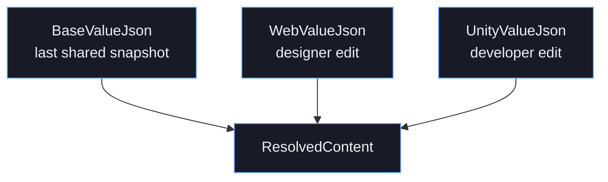
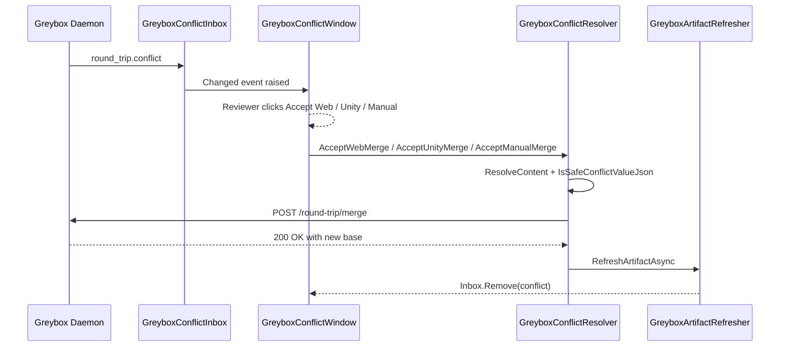
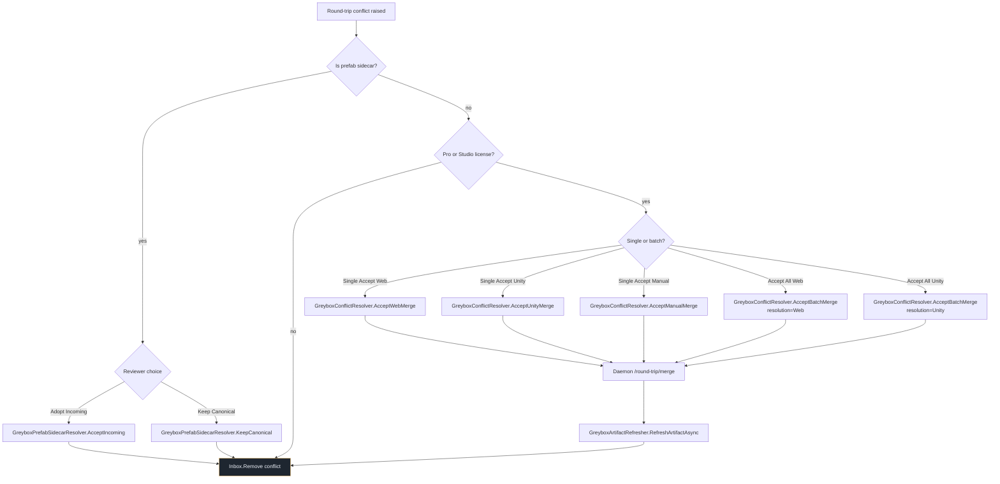

# Round-Trip Conflict Resolution

Greybox Studio keeps the web designer and the Unity Editor in sync through
a three-way JSON merge. Whenever the daemon detects diverging edits on the
same artifact field, it raises a *round-trip conflict* that the Unity
editor surfaces in `Window > Greybox > Round-Trip Conflicts`.

This document explains the merge model, the conflict lifecycle, and the
exact public methods that drive it.

## Inputs to the merge

For every conflict, the daemon ships three snapshots:

| Snapshot | Source | Held in |
|---|---|---|
| `BaseValueJson` | Last shared state before either side edited | `GreyboxRoundTripConflict.BaseValueJson` |
| `WebValueJson` | Greybox web app's current value | `GreyboxRoundTripConflict.WebValueJson` |
| `UnityValueJson` | Unity-side current value | `GreyboxRoundTripConflict.UnityValueJson` |

`GreyboxRoundTripConflict` (`Editor/Sync/GreyboxConflictInbox.cs:16`) is a
plain DTO. Conflicts enter the inbox through
`GreyboxConflictInbox.RecordFromEvent` (line 130) when the daemon emits a
`round_trip.conflict` websocket frame, or
`GreyboxConflictInbox.RecordPrefabSidecar` (line 61) when Unity detects
user-added components on a regenerated prefab.

## Resolution flow

`GreyboxConflictResolver` (`Editor/Sync/GreyboxConflictResolver.cs:24`)
exposes four entry points. Each maps to a button in the
`GreyboxConflictWindow` toolbar.

| Action | Method | What it stores |
|---|---|---|
| Accept Web | `AcceptWebMerge` (line 47) | The designer's snapshot becomes the new base. |
| Accept Unity | `AcceptUnityMerge` (line 42) | The Unity editor's snapshot becomes the new base. |
| Accept Manual | `AcceptManualMerge` (line 52) | The reviewer's hand-edited draft becomes the new base. |
| Accept All Web / Accept All Unity | `AcceptBatchMerge` (line 57) | Applies the same choice across every non-sidecar conflict in the inbox. |

All four delegate to `AcceptResolvedMergeAsync` which posts a
`round_trip.resolution` message to the daemon and then calls
`GreyboxArtifactRefresher.RefreshArtifactAsync` so the Unity-side proxy
reflects the new shared base.

### Sequence

### Decision tree

## Three-way merge details

For non-sidecar conflicts, `GreyboxConflictResolver.ResolveContent`
returns the chosen branch verbatim - we deliberately do not attempt a
field-level merge once a conflict has been raised. The field-level merge
already happens upstream in the daemon, which builds the three-way diff
using `GreyboxRoundTripFieldMapper.TryMap`
(`Editor/Sync/GreyboxRoundTripFieldMapper.cs:32`) on the Unity side and
the equivalent transform table on the web side. Only fields the mapper
declares as round-trip-safe surface as conflicts; everything else is
mirrored automatically and never reaches the conflict inbox.

Concretely, every conflict satisfies:

1. `BaseValueJson` is non-empty and equal to the shared snapshot the
   daemon held before either client edited.
2. `WebValueJson` differs from `BaseValueJson`.
3. `UnityValueJson` differs from `BaseValueJson`.
4. `WebValueJson` differs from `UnityValueJson`.

If any of the four invariants fail, the daemon skips raising a conflict
and writes the winning side directly into the inbox-bypass channel.

## Prefab sidecar conflicts

Prefab sidecar conflicts are conceptually different from JSON conflicts:
the reviewer is choosing between a regenerated prefab from the daemon and
a canonical prefab whose Unity components the developer has customized.
`GreyboxConflictWindow.DrawPrefabSidecar` renders dedicated controls and
hides Accept Web / Accept Unity / Accept Manual:

| Action | Method |
|---|---|
| Ping Canonical Prefab | `GreyboxPrefabSidecarResolver.CanonicalPath` (loaded via `AssetDatabase.LoadAssetAtPath`) |
| Adopt Incoming | `GreyboxPrefabSidecarResolver.AcceptIncoming` |
| Ping Incoming Prefab | `GreyboxPrefabSidecarResolver.IncomingPath` |
| Keep Canonical | `GreyboxPrefabSidecarResolver.KeepCanonical` |

The sidecar pattern means Greybox never silently overwrites user-added
components: the developer must explicitly opt into Adopt Incoming, and
Keep Canonical leaves the daemon-generated incoming prefab on disk for
later inspection.

## Licensing gates

Round-trip conflict resolution requires Pro or Studio entitlement.
`GreyboxConflictWindow.OnGUI` calls `GreyboxLicenseState.CurrentCapabilities()`
(`Editor/Windows/GreyboxLicenseState.cs`) and disables Accept buttons when
`CanRoundTrip` is false. Free Personal and Indie can still inspect
conflicts and copy any value to the clipboard, but the resolver methods
short-circuit with a console warning if invoked.

## Safety budget

`GreyboxConflictResolver` defines explicit limits that match the daemon
contract:

| Constant | Value | Purpose |
|---|---|---|
| `MaxRoundTripFileNameLength` | 512 | Cap on `FileName` |
| `MaxRoundTripConflictPathLength` | 512 | Cap on JSON path |
| `MaxRoundTripConflictValueJsonChars` | 1,048,576 | Cap on any value JSON |
| `MaxResolvedMergeContentChars` | 1,048,576 | Cap on resolved blob sent back |
| `MaxRoundTripMergePayloadBytes` | 1,056,768 | Cap on the merge POST body |
| `MaxRoundTripMergeRequestMs` | 2,000 | Latency budget for the daemon |
| `MaxConflicts` (Inbox) | 100 | Visible-queue cap |

Anything above the JSON or payload cap is dropped with a console warning
and never sent to the daemon - this is the same hardening pattern the
daemon enforces in reverse.

## Related files

- `Editor/Sync/GreyboxConflictResolver.cs` - Accept Web / Unity / Manual / Batch entry points.
- `Editor/Sync/GreyboxConflictInbox.cs` - Inbox storage, deduping, EditorPrefs snapshot.
- `Editor/Sync/GreyboxRoundTripFieldMapper.cs` - Round-trip-safe field table.
- `Editor/Sync/GreyboxRoundTripMetadataSync.cs` - Name-selector path rewriting on Unity-side edits.
- `Editor/Sync/GreyboxPrefabSidecarResolver.cs` - Adopt Incoming / Keep Canonical actions.
- `Editor/Windows/GreyboxConflictWindow.cs` - Unity Editor UI.
- `Editor/Sync/GreyboxArtifactRefresher.cs` - Post-merge artifact refresh.

For the higher-level sync contract, see
`Documentation~/round-trip-sync.md`.
