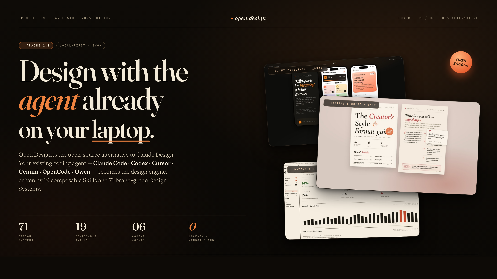
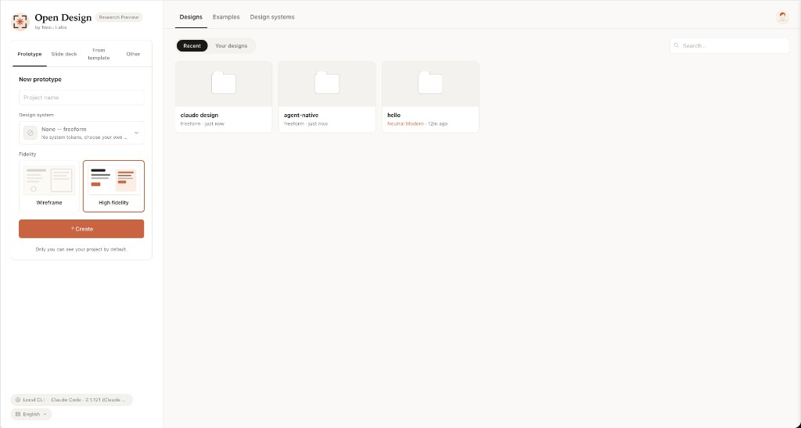
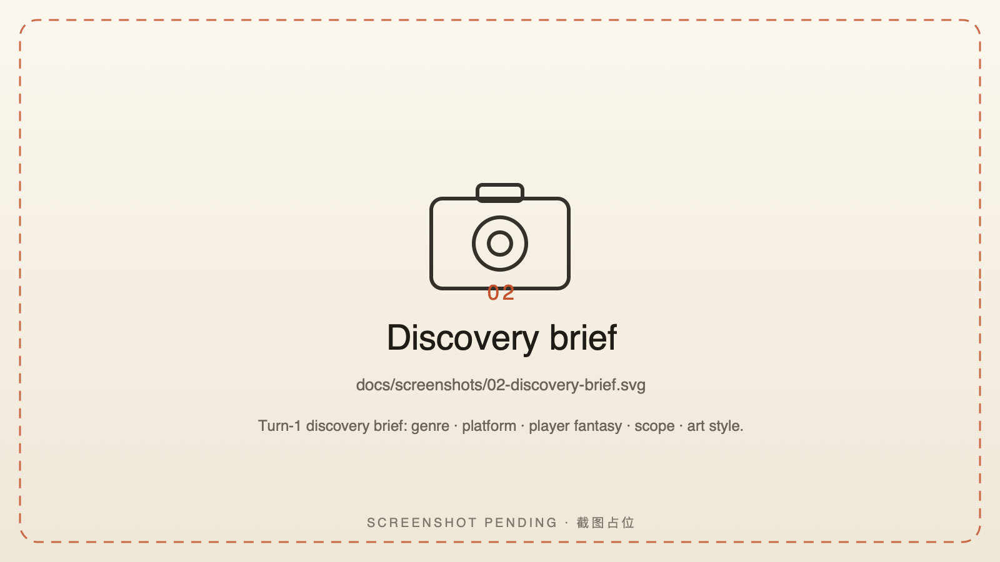
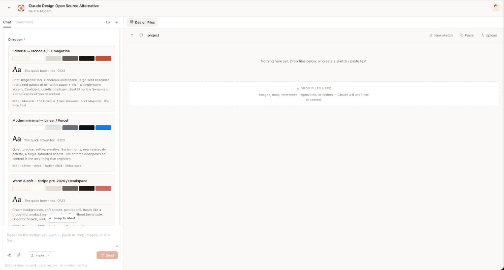
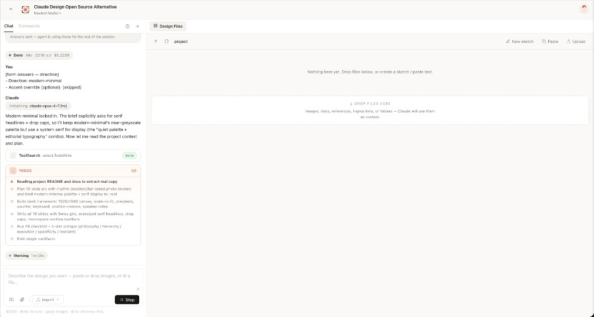
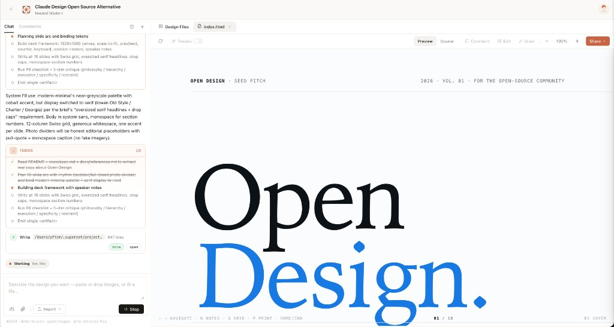
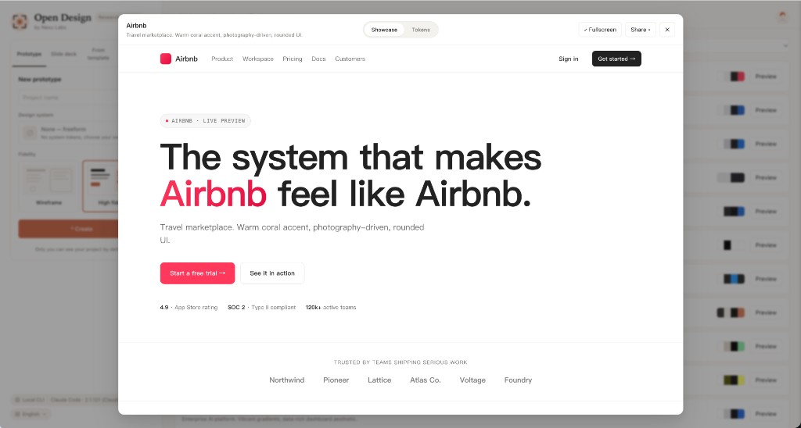
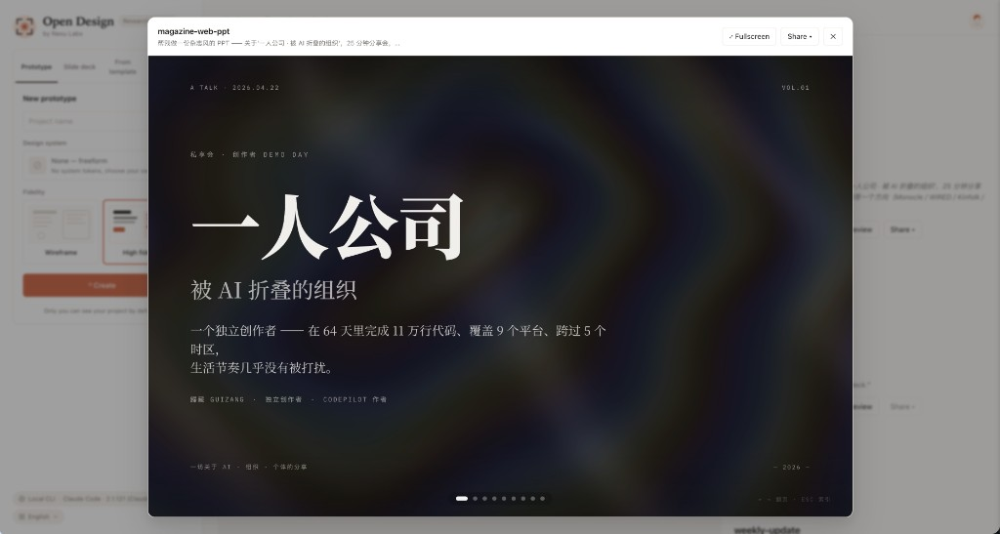
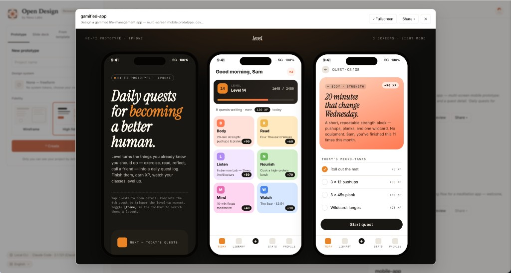
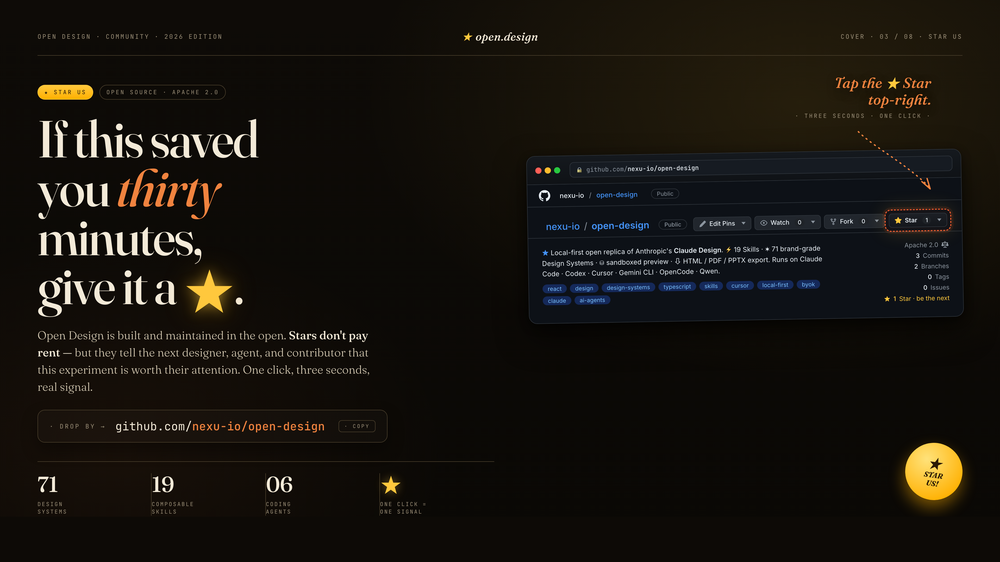

# AI Game Design Studio

> **A local-first game design studio powered by coding agents.** Build playable HTML game concepts, mobile game flows, desktop game HUDs, level boards, game pitch decks, key art prompts, trailer beats, and audio kits. **16 coding-agent CLIs** auto-detected on your `PATH` become the game-design engine, driven by composable game skills and game art bibles. No CLI? An OpenAI-compatible BYOK proxy is the same loop minus the spawn.

<p align="center">
  
</p>

<p align="center">
  <a href="https://github.com/ai-game-design-studio/ai-game-design-studio/stargazers"></a>
  <a href="https://github.com/ai-game-design-studio/ai-game-design-studio/network/members"></a>
  <a href="https://github.com/ai-game-design-studio/ai-game-design-studio/issues"></a>
  <a href="https://github.com/ai-game-design-studio/ai-game-design-studio/pulls"></a>
  <a href="https://github.com/ai-game-design-studio/ai-game-design-studio/graphs/contributors"></a>
  <a href="https://github.com/ai-game-design-studio/ai-game-design-studio/commits/main"></a>
  <a href="https://github.com/ai-game-design-studio/ai-game-design-studio/commits/main"></a>
</p>

<p align="center">
  <a href="https://ai-game-design.studio/"></a>
  <a href="https://github.com/ai-game-design-studio/ai-game-design-studio/releases"></a>
  <a href="LICENSE"></a>
  <a href="#supported-coding-agents"></a>
  <a href="#game-art-bibles"></a>
  <a href="#skills"></a>
  <a href="https://discord.gg/qhbcCH8Am4"></a>
  <a href="https://github.com/ai-game-design-studio/ai-game-design-studio/discussions"></a>
  <a href="QUICKSTART.md"></a>
</p>

<p align="center"><b>English</b> · <a href="README.es.md">Español</a> · <a href="README.pt-BR.md">Português (Brasil)</a> · <a href="README.de.md">Deutsch</a> · <a href="README.fr.md">Français</a> · <a href="README.zh-CN.md">简体中文</a> · <a href="README.zh-TW.md">繁體中文</a> · <a href="README.ko.md">한국어</a> · <a href="README.ja-JP.md">日本語</a> · <a href="README.ar.md">العربية</a> · <a href="README.ru.md">Русский</a> · <a href="README.uk.md">Українська</a> · <a href="README.tr.md">Türkçe</a></p>

---

## Why this exists

Game teams do not need another generic artifact generator. They need a local studio brain that can ask the right pre-production questions, hold a game vision across files, and turn a rough pitch into playable concepts, HUDs, levels, economy specs, lore, art direction, trailers, and production plans.

**AI Game Design Studio is built around that game-design loop.** It uses an artifact-first workflow, but every default prompt, skill, template, art bible, and critique gate is specialized around game systems. We don't ship an agent — the strongest coding agents already live on your laptop. We wire them into a skill-driven workflow that runs locally with `pnpm tools-dev`, can deploy the web layer to Vercel, and stays BYOK at every layer.

Type `build a mobile roguelike dungeon crawler playable concept`. The interactive discovery brief opens before the model improvises a single pixel. The agent locks genre, camera, controls, loop, platform, and art direction. A live `TodoWrite` plan streams into the UI. The daemon builds a real on-disk project folder with a game skill, craft rules, and self-check gates. The agent reads them, runs a game-design critique against its own output, and emits a single playable `<artifact>` that renders in a sandboxed iframe seconds later.

That's not "AI tries to design something". That's an AI that has been trained, by the prompt stack, to behave like a senior game designer with a working filesystem, a deterministic art-bible library, and a checklist culture.

AI Game Design Studio stands on three open-source shoulders:

- [**`alchaincyf/huashu-design`**](https://github.com/alchaincyf/huashu-design) — the creative-quality compass. Its workflow discipline, anti-AI-slop checklist, 5-dimensional self-critique, and direction-picker structure are retuned for game pillars, art bibles, HUD readability, and production plausibility in [`apps/daemon/src/prompts/discovery.ts`](apps/daemon/src/prompts/discovery.ts).
- [**`OpenCoworkAI/open-codesign`**](https://github.com/OpenCoworkAI/open-codesign) — the artifact interaction-loop reference. We adapt the streaming-artifact loop, sandboxed-iframe preview pattern, live agent panel, interruptible generation, and multi-format export pattern into a game-studio workspace. We deliberately diverge on form factor — they are a desktop Electron shell bundling [`pi-ai`][piai]; we are a browser studio + local daemon that delegates to your existing CLI.
- [**`multica-ai/multica`**](https://github.com/multica-ai/multica) — the daemon-and-runtime architecture. PATH-scan agent detection, the local daemon as the only privileged process, the agent-as-teammate worldview.

## At a glance

| | What you get |
|---|---|
| **Coding-agent CLIs (16)** | Claude Code · Codex CLI · Devin for Terminal · Cursor Agent · Gemini CLI · OpenCode · Qwen Code · Qoder CLI · GitHub Copilot CLI · Hermes (ACP) · Kimi CLI (ACP) · Pi (RPC) · Kiro CLI (ACP) · Kilo (ACP) · Mistral Vibe CLI (ACP) · DeepSeek TUI — auto-detected on `PATH`, swap with one click |
| **BYOK fallback** | Protocol-specific API proxy at `/api/proxy/{anthropic,openai,azure,google}/stream` — paste `baseUrl` + `apiKey` + `model`, choose Anthropic / OpenAI / Azure OpenAI / Google Gemini, and the daemon normalizes SSE back to the same chat stream. Internal-IP/SSRF blocked at the daemon edge. |
| **Game art bibles built-in** | Game-first systems such as Arcade Neon, Fantasy RPG, Sci-Fi Tactical, Cozy Casual, Pixel Retro, Horror Survival, Sports Broadcast, and Stylized 3D, plus retuned art-bible frameworks for saved projects. |
| **Game skills built-in** | Playable concept, mobile game flow, desktop game UI, HUD system, level design board, game art bible, game pitch deck, GDD, combat systems, economy progression, narrative branching, procedural generation, live ops, game key art, game trailer motion, and game audio kit. Legacy non-game skill folders are removed; old ids redirect to game-native replacements only. |
| **Media generation** | Image · video · audio surfaces ship alongside the design loop. **gpt-image-2** (Azure / OpenAI) for key art, character sheets, environment concepts, weapon studies, HUD mockups, and illustrated maps · **Seedance 2.0** (ByteDance) for cinematic trailer beats · **HyperFrames** ([heygen-com/hyperframes](https://github.com/heygen-com/hyperframes)) for HTML→MP4 game motion graphics such as gameplay reveals, HUD transitions, balance charts, match overlays, and logo outros. Game-first prompt templates live under [`prompt-templates/`](prompt-templates/), with preview thumbnails and source attribution. Same chat surface as code; outputs a real `.mp4` / `.png` chip into the project workspace. |
| **Game art directions** | 8 curated game directions (Arcade Neon · Cozy Adventure · Tactical Sci-Fi HUD · Fantasy RPG · Horror Survival · Pixel Retro · Stylized 3D · Kids/Casual), each with deterministic OKLch palette + font stack ([`apps/daemon/src/prompts/directions.ts`](apps/daemon/src/prompts/directions.ts)) |
| **Device frames** | iPhone 15 Pro · Pixel · iPad Pro · MacBook · Browser Chrome — pixel-accurate, shared across skills under [`assets/frames/`](assets/frames/) |
| **Agent runtime** | Local daemon spawns the CLI in your project folder — agent gets real `Read`, `Write`, `Bash`, `WebFetch` against a real on-disk environment, with Windows `ENAMETOOLONG` fallbacks (stdin / prompt-file) on every adapter |
| **Imports** | Drop a legacy game-studio ZIP onto the welcome dialog — the compatibility route parses it into a real project so your agent can keep editing the playable concept |
| **Persistence** | SQLite at `.agds/app.sqlite`: projects · conversations · messages · tabs · saved templates. Reopen tomorrow, todo card and open files are exactly where you left them. |
| **Lifecycle** | One entry point: `pnpm tools-dev` (start / stop / run / status / logs / inspect / check) — boots daemon + web (+ desktop) under typed sidecar stamps |
| **Desktop** | Optional Electron shell with sandboxed renderer + sidecar IPC (STATUS / EVAL / SCREENSHOT / CONSOLE / CLICK / SHUTDOWN) — drives `tools-dev inspect desktop screenshot` for E2E |
| **Deployable to** | Local (`pnpm tools-dev`) · Vercel web layer · packaged Electron desktop studio for macOS (Apple Silicon) and Windows (x64) — download from [ai-game-design.studio](https://ai-game-design.studio/) or the [latest release](https://github.com/ai-game-design-studio/ai-game-design-studio/releases) |
| **License** | Apache-2.0 |

[acd2]: https://github.com/VoltAgent/awesome-design-md
## Demo

<table>
<tr>
<td width="50%">
<br/>
<sub><b>Entry view</b> — pick a game skill, pick a game art bible, type the brief. The same surface covers playable concepts, HUDs, level boards, GDD decks, key art, trailers, and audio kits.</sub>
</td>
<td width="50%">
<br/>
<sub><b>Turn-1 discovery brief</b> — before the model writes a pixel, AI Game Design Studio locks the game type, genre, platform, camera, loop, controls, audience, art style, and scene/state count.</sub>
</td>
</tr>
<tr>
<td width="50%">
<br/>
<sub><b>Direction picker</b> — when the creator has no art direction, the agent offers curated game looks such as Arcade Neon, Cozy Adventure, Tactical Sci-Fi HUD, Fantasy RPG, Horror Survival, Pixel Retro, Stylized 3D, and Kids/Casual.</sub>
</td>
<td width="50%">
<br/>
<sub><b>Live todo progress</b> — the agent's plan streams as a live card. <code>in_progress</code> → <code>completed</code> updates land in real time. The creator can redirect cheaply, mid-flight.</sub>
</td>
</tr>
<tr>
<td width="50%">
<br/>
<sub><b>Sandboxed preview</b> — every <code>&lt;artifact&gt;</code> renders in a clean srcdoc iframe. Editable in place via the file workspace; downloadable as HTML, PDF, ZIP.</sub>
</td>
<td width="50%">
<br/>
<sub><b>Game art bible library</b> — every game system shows palette, shape language, UI tokens, and art direction notes. Click for the full <code>DESIGN.md</code>, swatch grid, and live showcase.</sub>
</td>
</tr>
<tr>
<td width="50%">
<br/>
<sub><b>Game pitch / GDD deck</b> — deck mode frames fantasy, pillars, loop, audience, market, mechanics, roadmap, art direction, and production plan as a studio-ready HTML deck with PDF export.</sub>
</td>
<td width="50%">
<br/>
<sub><b>Mobile game flow</b> — portrait and landscape game flows cover home, level select, gameplay, pause, results, shop/upgrades, safe areas, and touch-first controls.</sub>
</td>
</tr>
</table>

## Skills

**Game-first skills ship in the box.** Each is a folder under [`skills/`](skills/) following the Claude Code [`SKILL.md`][skill] convention with extended `agds:` frontmatter that the daemon parses verbatim — `mode`, `platform`, `scenario`, optional `game` hints, `preview.type`, `game_art_bible.requires`, `default_for`, `featured`, `fidelity`, `speaker_notes`, `animations`, and `example_prompt` ([`apps/daemon/src/skills.ts`](apps/daemon/src/skills.ts)).

The runtime modes stay compatible, but their creator-facing jobs are game-specific: **Playable Concept**, **Game Pitch / GDD Deck**, **Game Template**, **Game Art Bible**, plus **Image**, **Video**, and **Audio** for key art, trailer, and sound surfaces. The **`scenario`** field groups skills by game area: `gameplay` · `hud` · `menu` · `level` · `character` · `world` · `pitch` · `asset` · `audio` · `trailer` · `systems`.

### Game design surfaces

| Skill | Platform | Scenario | What it produces |
|---|---|---|---|
| [`playable-game-prototype`](skills/playable-game-prototype/) | responsive web game | gameplay | Single-file playable HTML game loop with input, HUD, feedback, pause/restart, and win/fail/progress states |
| [`mobile-game-flow`](skills/mobile-game-flow/) | mobile portrait/landscape | menu | Home, level select, gameplay, pause, results, shop/upgrades, and touch-safe framing |
| [`desktop-game-ui`](skills/desktop-game-ui/) | desktop browser game | hud/menu | Main menu, settings, HUD, inventory, map, quest, and state panels |
| [`game-hud-system`](skills/game-hud-system/) | desktop/mobile | hud | Health, stamina, ammo, minimap, quests, cooldowns, timers, touch controls, and readability states |
| [`level-design-board`](skills/level-design-board/) | desktop/tablet | level | Level map, encounter beats, traversal, hazards, collectibles, pacing, camera notes |
| [`game-art-bible`](skills/game-art-bible/) | document/html | world | Visual identity, palette, shape language, characters, environments, props, FX, UI tokens |
| [`game-pitch-deck`](skills/game-pitch-deck/) | deck | pitch | Studio/investor GDD deck covering fantasy, loop, audience, market, mechanics, roadmap |
| [`game-key-art`](skills/game-key-art/) | image | asset | Splash art, character, environment, icon, prop, and UI-panel prompts |
| [`game-trailer-motion`](skills/game-trailer-motion/) | video | trailer | Reveal shots, UI motion, ability showcases, trailer beats, and HyperFrames prompts |
| [`game-audio-kit`](skills/game-audio-kit/) | audio | audio | Music loops, UI sounds, ambience, combat hits, collectible, victory/defeat prompts |
| [`sprite-animation`](skills/sprite-animation/) | 2D assets | character | Sprite sheets and animation-state design |
| [`critique`](skills/critique/) | any | systems | Game-design critique for readability, input clarity, feedback, game feel, progression, art cohesion |
| [`tweaks`](skills/tweaks/) | playable/live | systems | Live game tuning for palette, UI scale, camera, difficulty, speed, and effects intensity |

Adding a skill takes one folder. Read [`docs/skills-protocol.md`](docs/skills-protocol.md) for the extended frontmatter, fork an existing skill, restart the daemon, it appears in the picker. The catalog endpoint is `GET /api/skills`; per-skill seed assembly (template + side-file references) lives at `GET /api/skills/:id/example`.

## Six load-bearing ideas

### 1 · We don't ship an agent. Yours is good enough.

The daemon scans your `PATH` for [`claude`](https://docs.anthropic.com/en/docs/claude-code), [`codex`](https://github.com/openai/codex), `devin`, [`cursor-agent`](https://www.cursor.com/cli), [`gemini`](https://github.com/google-gemini/gemini-cli), [`opencode`](https://opencode.ai/), [`qwen`](https://github.com/QwenLM/qwen-code), `qodercli`, [`copilot`](https://github.com/features/copilot/cli), `hermes`, `kimi`, [`pi`](https://github.com/badlogic/pi-mono/tree/main/packages/coding-agent), [`kiro-cli`](https://kiro.dev), `kilo`, [`vibe-acp`](https://github.com/mistralai/mistral-vibe), and `deepseek` on startup. Whichever ones it finds become candidate game-design engines — driven over stdio with one adapter per CLI, swappable from the model picker. Inspired by [`multica`](https://github.com/multica-ai/multica) and [`cc-switch`](https://github.com/farion1231/cc-switch). No CLI installed? The API mode is the same pipeline minus the spawn — choose Anthropic, OpenAI-compatible, Azure OpenAI, or Google Gemini and the daemon forwards normalized SSE chunks back. Loopback is allowed for local LLM providers such as Ollama and LM Studio; non-loopback private, link-local, CGNAT, multicast, reserved, and redirect targets are rejected at the daemon edge.

### 2 · Skills are files, not plugins.

Following Claude Code's [`SKILL.md` convention](https://docs.anthropic.com/en/docs/claude-code/skills), each skill is `SKILL.md` + optional `assets/` + `references/`. Drop a folder into [`skills/`](skills/), restart the daemon, it appears in the picker. Featured defaults now route to game-native skills, and legacy non-game skill folders are rejected by the guard.

### 3 · Game art bibles are portable Markdown, not appearance JSON.

The `DESIGN.md` schema now describes game-facing color, typography, spacing, HUD layout, motion, tone, shape language, materials, FX, accessibility, and anti-patterns. Every artifact reads from the active game art bible. Switch bible → next render uses the new biome, rarity, danger, healing, cooldown, objective, and interactable tokens.

### 4 · The interactive discovery brief prevents 80% of redirects.

AI Game Design Studio's prompt stack hard-codes a `RULE 1`: every fresh game-design brief begins with a `<question-form id="discovery">` discovery brief instead of code. Game type · platform · genre · camera · core loop · controls · audience · art style · scene/state count · constraints. A long brief still leaves game decisions open — player fantasy, readability, input model, art direction, scope — exactly the things the brief locks down in 30 seconds.

This is the **Junior Game Designer mode**: batch the questions up front, show something playable or stateful early (even a greybox with real controls), let the creator redirect cheaply. Combined with the game art bible protocol, it keeps output from drifting into generic interface mockups and makes the agent feel like a designer who understood the game before painting.

### 5 · The daemon makes the agent feel like it's on your laptop, because it is.

The daemon spawns the CLI with `cwd` set to the project's artifact folder under `.agds/projects/<id>/`. The agent gets `Read`, `Write`, `Bash`, `WebFetch` — real tools against a real filesystem. It can `Read` the skill's `assets/template.html`, `grep` your CSS for hex values, write an `art-direction-spec.md`, drop generated images, and produce `.pptx` / `.zip` / `.pdf` files that show up in the file workspace as download chips when the turn ends. Sessions, conversations, messages, tabs persist in a local SQLite DB — pop the project open tomorrow and the agent's todo card is right where you left it.

### 6 · The prompt stack is the studio engine.

What you compose at send time isn't "system + creator request". It's:

```
DISCOVERY directives  (turn-1 brief, turn-2 art-direction branch, TodoWrite, 5-dim critique)
  + identity charter   (OFFICIAL_DESIGNER_PROMPT, anti-AI-slop, junior-pass)
  + active DESIGN.md   (game art bible)
  + active SKILL.md    (game skill)
  + project metadata   (kind, fidelity, speakerNotes, animations, game-design memory, inspiration ids)
  + skill side files   (auto-injected pre-flight: read assets/template.html + references/*.md)
  + (deck kind, no skill seed) DECK_FRAMEWORK_DIRECTIVE   (nav / counter / scroll / print)
```

Every layer is composable. Every layer is a file you can edit. Read [`apps/daemon/src/prompts/system.ts`](apps/daemon/src/prompts/system.ts) and [`apps/daemon/src/prompts/discovery.ts`](apps/daemon/src/prompts/discovery.ts) to see the actual contract.

## Architecture

```
┌────────────────────── browser (Next.js 16) ──────────────────────┐
│  chat · file workspace · iframe preview · settings · imports     │
└──────────────┬───────────────────────────────────┬───────────────┘
               │ /api/* (rewritten in dev)          │
               ▼                                    ▼
   ┌──────────────────────────────────┐   /api/proxy/{provider}/stream (SSE)
   │  Local daemon (Express + SQLite) │   ─→ any OpenAI-compat
   │                                  │       endpoint (BYOK)
   │  /api/agents          /api/skills│       w/ SSRF blocking
   │  /api/game-art-bibles /api/projects/…
   │  /api/chat (SSE)      /api/proxy/{provider}/stream (SSE)
   │  /api/templates       legacy ZIP import
   │  /api/artifacts/save  /api/artifacts/lint
   │  /api/upload          /api/projects/:id/files…
   │  /artifacts (static)  /frames (static)
   │
   │  optional: sidecar IPC at /tmp/agds/ipc/<ns>/<app>.sock
   │  (STATUS · EVAL · SCREENSHOT · CONSOLE · CLICK · SHUTDOWN)
   └─────────┬────────────────────────┘
             │ spawn(cli, [...], { cwd: .agds/projects/<id> })
             ▼
   ┌──────────────────────────────────────────────────────────────────┐
   │  claude · codex · devin (ACP) · gemini · opencode · cursor-agent │
   │  qwen · qoder · copilot · hermes (ACP) · kimi (ACP) · pi (RPC) · kiro (ACP) · kilo (ACP) · vibe (ACP) · deepseek  │
   │  reads SKILL.md + DESIGN.md, writes artifacts to disk            │
   └──────────────────────────────────────────────────────────────────┘
```

| Layer | Stack |
|---|---|
| Frontend | Next.js 16 App Router + React 18 + TypeScript, Vercel-deployable |
| Daemon | Node 24 · Express · SSE streaming · `better-sqlite3`; tables: `projects` · `conversations` · `messages` · `tabs` · `templates` |
| Agent transport | `child_process.spawn`; typed-event parsers for `claude-stream-json` (Claude Code), `qoder-stream-json` (Qoder CLI), `copilot-stream-json` (Copilot), `json-event-stream` per-CLI parsers (Codex / Gemini / OpenCode / Cursor Agent), `acp-json-rpc` (Devin / Hermes / Kimi / Kiro / Kilo / Mistral Vibe via Agent Client Protocol), `pi-rpc` (Pi via stdio JSON-RPC), `plain` (Qwen Code / DeepSeek TUI) |
| BYOK proxy | `POST /api/proxy/{anthropic,openai,azure,google}/stream` → provider-specific upstream APIs, normalized `delta/end/error` SSE; allows loopback local LLM providers, rejects non-loopback private/link-local/CGNAT/multicast/reserved hosts, and disables upstream redirects at the daemon edge |
| Storage | Plain files in `.agds/projects/<id>/` + SQLite at `.agds/app.sqlite` + credentials at `.agds/media-config.json` (gitignored, auto-created). `AGDS_DATA_DIR=<dir>` relocates all daemon data (used for test isolation and read-only-install setups); `AGDS_MEDIA_CONFIG_DIR=<dir>` further narrows the override to just `media-config.json` for setups that want to keep API keys outside the data dir. If `.agds/` is absent but an older retired data root already contains saved projects, the daemon opens that folder as a compatibility fallback. |
| Preview | Sandboxed iframe via `srcdoc` + per-skill `<artifact>` parser ([`apps/web/src/artifacts/parser.ts`](apps/web/src/artifacts/parser.ts)) |
| Export | HTML (inline assets) · PDF (browser print, deck-aware) · PPTX (agent-driven via skill) · ZIP (archiver) · Markdown |
| Lifecycle | `pnpm tools-dev start \| stop \| run \| status \| logs \| inspect \| check`; ports via `--daemon-port` / `--web-port`, namespaces via `--namespace` |
| Desktop (optional) | Electron shell — discovers the web URL through sidecar IPC, no port guessing; same `STATUS`/`EVAL`/`SCREENSHOT`/`CONSOLE`/`CLICK`/`SHUTDOWN` channel powers `tools-dev inspect desktop …` for E2E |

## Quickstart

### Download the desktop build (no compile required)

The fastest way to try AI Game Design Studio is the prebuilt desktop studio — no Node, no pnpm, no clone:

- **[ai-game-design.studio](https://ai-game-design.studio/)** — official download page
- **[GitHub releases](https://github.com/ai-game-design-studio/ai-game-design-studio/releases)**


### Run with Docker

Run AI Game Design Studio without installing Node.js or pnpm locally.

#### Requirements

* Docker Desktop
* Docker Compose v2

Verify Docker:

```bash id="70jv9o"
docker compose version
```

#### Start AI Game Design Studio

```bash id="m9w43w"
git clone https://github.com/ai-game-design-studio/ai-game-design-studio.git
cd ai-game-design-studio/deploy
docker compose up -d
```

Open in your browser:

```text id="4s4xeh"
http://localhost:7456
```

#### Common Commands

```bash id="gl95kp"
# View logs
docker compose logs -f

# Restart containers
docker compose restart

# Stop containers
docker compose down

# Pull latest image
docker compose pull
docker compose up -d
```

For advanced Docker configuration and environment variables, see [`QUICKSTART.md`](QUICKSTART.md).


### Run from source

```bash
git clone https://github.com/ai-game-design-studio/ai-game-design-studio.git
cd ai-game-design-studio
corepack enable
corepack pnpm --version   # should print 10.33.2
pnpm install
pnpm tools-dev run web
# open the web URL printed by tools-dev
```

Environment requirements: Node `~24` and pnpm `10.33.x`. `nvm`/`fnm` are optional helpers only; if you use one, run `nvm install 24 && nvm use 24` or `fnm install 24 && fnm use 24` before `pnpm install`.

For desktop/background startup, fixed-port restarts, and media generation dispatcher checks (`AGDS_BIN`, `AGDS_DAEMON_URL`, `apps/daemon/dist/cli.js`), see [`QUICKSTART.md`](QUICKSTART.md).

To seed a repo-style game project before opening the studio:

```bash
npx agds init my-game --template 2d-platformer --designer "Your Name"
```

This writes `DESIGN.md`, `README.md`, and `gameplay-encounter.gameview.json` without touching the daemon's hidden runtime state.

Creator skills can be managed without starting the daemon:

```bash
agds skills install studio/tempo-combat-lab
agds skill add /absolute/path/to/local-skill
agds skill list --installed
agds skill test tempo-combat-lab
agds skill remove tempo-combat-lab
```

The first load:

1. Detects which agent CLIs you have on `PATH` and picks one automatically.
2. Loads the game skill catalog + game art bible systems.
3. Pops the welcome dialog so you can paste an Anthropic key (only needed for the BYOK fallback path).
4. **Auto-creates `./.agds/`** — the local runtime folder for the SQLite project DB, per-project artifacts, and saved renders. `agds init` is optional project scaffolding; the daemon still `mkdir`s runtime state on boot.

Type a prompt, hit **Send**, watch the discovery brief arrive, fill it, watch the todo card stream, watch the artifact render. Click **Save to disk** or download as a project ZIP.

### First-run state (`./.agds/`)

The daemon owns one hidden folder at the repo root. Everything in it is gitignored and machine-local — never commit it.

```
.agds/
├── app.sqlite                 ← projects · conversations · messages · open tabs
├── artifacts/                 ← one-off "Save to disk" renders (timestamped)
└── projects/<id>/             ← per-project working dir, also the agent's cwd
```

| Want to… | Do this |
|---|---|
| Inspect what's in there | `ls -la .agds && sqlite3 .agds/app.sqlite '.tables'` |
| Reset to a clean slate | `pnpm tools-dev stop`, `rm -rf .agds`, run `pnpm tools-dev run web` again |
| Move it elsewhere | `AGDS_DATA_DIR=<absolute-or-relative-path> pnpm tools-dev run web` — the daemon resolves `~/` and anchors relative paths to the repo root. `AGDS_MEDIA_CONFIG_DIR=<dir>` narrows the override to just `media-config.json` if you want credentials in a separate location. |

#### Migrating a retired repo data root into the installed Desktop build

If you ran an older repo build before the AGDS data-root switch and only later installed the packaged Desktop build, the two writers point at different roots:

- Current repo dev-server (`pnpm tools-dev start web`) writes to `<repo-root>/.agds/` for fresh work; older repo builds wrote to a retired hidden data-root folder.
- Installed Desktop build writes under `<appData>/AI Game Design Studio/namespaces/<channel>/data/`, where `<appData>` is Electron's per-OS studio-data base (everything before the `AI Game Design Studio` segment that `app.getPath("userData")` already includes). The channel suffix is **platform-specific** — the release workflows append `-win`/`-linux`:

  | Platform | `<appData>` (Electron `appData` base) | Stable channel | Beta channel |
  |---|---|---|---|
  | macOS | `~/Library/Application Support` | `release-stable` | `release-beta` |
  | Windows | `%APPDATA%` (= `%USERPROFILE%\AppData\Roaming`) | `release-stable-win` | `release-beta-win` |
  | Linux | `$XDG_CONFIG_HOME` (default `~/.config`) | `release-stable-linux` | `release-beta-linux` |

  Example resolved paths:
  - macOS beta: `~/Library/Application Support/AI Game Design Studio/namespaces/release-beta/data/`
  - Windows beta: `%APPDATA%\AI Game Design Studio\namespaces\release-beta-win\data\`
  - Linux beta: `~/.config/AI Game Design Studio/namespaces/release-beta-linux/data/`

  If unsure, inspect the packaged daemon log right after the app boots; it logs the resolved `daemonDataRoot`.

> **⚠️ Do this in a clean state.** Migration replaces (not merges) the Desktop build's data dir with your retired repo data root. Both writers must be fully stopped before copying — quit the Desktop build **and** stop the repo dev-server. SQLite-WAL needs to flush cleanly on both sides; if either daemon is still running it can write SQLite/WAL pages or project/artifact files mid-snapshot, leaving the staged copy inconsistent. If the Desktop build already has projects you care about, decide which side is authoritative before continuing — the steps below back up the Desktop's current `data/` to a sibling but do not merge.

##### Option A: one-shot auto-migration via `AGDS_LEGACY_DATA_DIR`

Use this when the Desktop build's `data/` is still empty, which is the typical state right after the upgrade that surfaced [#710](https://github.com/ai-game-design-studio/ai-game-design-studio/issues/710). Quit the Desktop build first (so its daemon is not holding `app.sqlite`), then re-launch with `AGDS_LEGACY_DATA_DIR` pointed at your old repo data root. The daemon stages your payload into a sibling tmp directory and only promotes it into `data/` on success; on any failure the staging directory is removed so the next boot retries cleanly.

The daemon refuses, with a visible startup error, when:

- the path in `AGDS_LEGACY_DATA_DIR` does not contain `app.sqlite` (typo, deleted source, wrong path), or
- the Desktop's `data/` already contains any of `app.sqlite`, `projects/`, `artifacts/`, `media-config.json`, etc. SQLite/WAL pairs and project trees cannot be safely interleaved, so the daemon refuses to merge instead of silently corrupting either side. If the Desktop has already booted and seeded its own `data/`, use Option B and decide explicitly which side wins.

A `.migrated-from` marker is written on success so subsequent boots no-op.

Quit the Desktop build first, then re-launch with this env set. The launcher must put the variable into the *studio process* environment, not just the shell that runs `open` / `xdg-open`.

Set `OLD_REPO_DATA_DIR` to the old repo's retired hidden data-root folder before running the examples below. For the default older repo layout, use the hidden data-root directory directly under that repo root.

**macOS** (LaunchServices does not inherit shell env, so use the direct binary):

```bash
OLD_REPO_DATA_DIR="<old repo data root>"
AGDS_LEGACY_DATA_DIR="$OLD_REPO_DATA_DIR" \
  "/Applications/AI Game Design Studio.app/Contents/MacOS/AI Game Design Studio"
```

If you prefer the Dock launcher, set the variable in `launchctl` first, open the app, then unset it:

```bash
launchctl setenv AGDS_LEGACY_DATA_DIR "$OLD_REPO_DATA_DIR"
open "/Applications/AI Game Design Studio.app"
# After the migration log line appears:
launchctl unsetenv AGDS_LEGACY_DATA_DIR
```

**Linux** (run the binary directly so the env var actually reaches it):

```bash
OLD_REPO_DATA_DIR="<old repo data root>"
AGDS_LEGACY_DATA_DIR="$OLD_REPO_DATA_DIR" /path/to/ai-game-design-studio
# (e.g. the AppImage you launched, or the unpacked binary under /opt)
```

**Windows (PowerShell):**

```powershell
$OldRepoDataDir = '<old repo data root>'
$env:AGDS_LEGACY_DATA_DIR=$OldRepoDataDir
& "$env:LOCALAPPDATA\Programs\AI Game Design Studio\AI Game Design Studio.exe"
```

The daemon log records `[agds-migrate] migration complete: copied N entries (...)`. After the first launch you can clear the env variable; the marker prevents re-migration even on subsequent runs.

##### Option B: manual copy

To carry your existing projects, SQLite, artifacts, and `media-config.json` over to the Desktop build, when Option A is not viable (Desktop already has its own data and you want to replace it explicitly).

**macOS / Linux (bash):**

```bash
set -euo pipefail
# 1. Stop both writers so the source and target are quiescent.
#    - Quit the Desktop build (Cmd+Q on macOS, File → Exit on Linux).
#    - Stop the repo dev-server: `pnpm tools-dev stop` from the repo root.
# 2. Set REPO and APP_DATA to your actual paths; the example below is macOS + beta.
REPO="/path/to/ai-game-design-studio"
OLD_REPO_DATA_DIR="<old repo data root>"
APP_DATA="$HOME/Library/Application Support/AI Game Design Studio/namespaces/release-beta/data"

# 3. Preflight: see what (if anything) the Desktop build already has.
ls "$APP_DATA/projects" 2>/dev/null && echo "Desktop already has projects, confirm this is a replace, not a merge."

# 4. Stage into a sibling first, then atomically swap into place. `set -e` plus
#    the explicit rsync exit check guarantee a non-zero copy aborts before any
#    `mv` runs, so the Desktop data dir cannot end up half-populated.
STAGE="${APP_DATA}.staged-$(date +%F-%H%M)"
mkdir -p "$STAGE"
rsync -a --exclude='backup-*' "$OLD_REPO_DATA_DIR/" "$STAGE/" || { echo "retired data-root rsync failed, aborting before swap"; exit 1; }

# 5. Backup the Desktop's current data, then promote the staged copy.
mv "$APP_DATA" "${APP_DATA}.fresh-baseline-$(date +%F-%H%M)"
mv "$STAGE" "$APP_DATA"

# 6. Relaunch the Desktop build. The daemon applies forward schema changes on boot.
```

**Windows (PowerShell):**

```powershell
$ErrorActionPreference = 'Stop'
# 1. Stop both writers so the source and target are quiescent.
#    - Quit the Desktop build (File > Exit).
#    - Stop the repo dev-server: `pnpm tools-dev stop` from the repo root.
# 2. Set $Repo and $AppData to your actual paths; the example below is stable channel.
$Repo    = 'C:\path\to\ai-game-design-studio'
$OldRepoDataDir = '<old repo data root>'
$AppData = Join-Path $env:APPDATA 'AI Game Design Studio\namespaces\release-stable-win\data'

# 3. Preflight: see what (if anything) the Desktop build already has.
if (Test-Path (Join-Path $AppData 'projects')) {
  Write-Host 'Desktop already has projects, confirm this is a replace, not a merge.'
}

# 4. Stage into a sibling first. Robocopy /MIR mirrors source to staging, and
#    its exit codes >= 8 are real errors (0..7 are success/info), so we guard
#    explicitly before promoting.
$Stamp = Get-Date -Format 'yyyy-MM-dd-HHmm'
$Stage = "$AppData.staged-$Stamp"
robocopy $OldRepoDataDir $Stage /MIR /XD 'backup-*' | Out-Null
if ($LASTEXITCODE -ge 8) { throw "robocopy failed (exit $LASTEXITCODE), aborting before swap" }

# 5. Backup the Desktop's current data, then promote the staged copy.
if (Test-Path $AppData) { Rename-Item $AppData "$AppData.fresh-baseline-$Stamp" }
Rename-Item $Stage $AppData

# 6. Relaunch the Desktop build. The daemon applies forward schema changes on boot.
```

If anything looks wrong after relaunch, restore the original Desktop data by deleting `$APP_DATA` (or `$AppData` on Windows) and renaming the `.fresh-baseline-*` directory back into place.

> **⚠️ Schema migrations are forward-only.** The daemon applies `CREATE TABLE IF NOT EXISTS` / `ALTER TABLE` changes on boot; there is no version guard. After migrating, **do not** open the same data dir with an older repo checkout — unsupported columns or behavior mismatches can leave the workspace inconsistent. Back up `app.sqlite*` before the first launch with the new build.

> **⚠️ Advanced: sharing one data dir between repo dev-server and Desktop build.** Pointing both at the same dir via `AGDS_DATA_DIR` is possible but **only safe one-at-a-time**. The daemon opens `app.sqlite` in WAL mode and writes uncoordinated files under `projects/` and `artifacts/`; running both writers concurrently can corrupt SQLite or clobber artifacts. Always stop the Desktop build before starting the dev-server, and stop the dev-server before opening the Desktop build:
>
> ```bash
> AGDS_DATA_DIR="$HOME/Library/Application Support/AI Game Design Studio/namespaces/release-beta/data" \
>   pnpm tools-dev start web
> ```

Full file map, scripts, and troubleshooting → [`QUICKSTART.md`](QUICKSTART.md).

## Running the Project

AI Game Design Studio can run as a browser-based studio shell or as an Electron desktop studio. Both modes share the same local daemon + studio runtime architecture.

### Web / Localhost (Default)

```bash
# Foreground mode — keeps the lifecycle command in the foreground (logs written to files)
pnpm tools-dev run web

# View recent logs:
pnpm tools-dev logs

# Background mode — daemon + web run as background processes
pnpm tools-dev start web
```

By default, `tools-dev` binds to available ephemeral ports and prints the actual URLs on startup. To use fixed ports from a stopped state:

```bash
pnpm tools-dev run web --daemon-port 17456 --web-port 17573
```

If daemon/web are already running, use `restart` to switch ports in the existing session:

```bash
pnpm tools-dev restart --daemon-port 17456 --web-port 17573
```

### Desktop / Electron

```bash
# Start daemon + web + desktop in the background
pnpm tools-dev

# Check desktop status
pnpm tools-dev inspect desktop status

# Take a screenshot of the desktop build
pnpm tools-dev inspect desktop screenshot --path /tmp/agds.png
```

The desktop build discovers the web URL automatically via sidecar IPC — no port guessing required.

### Other Useful Commands

| Command | What it does |
|---|---|
| `pnpm tools-dev status` | Show running sidecar statuses |
| `pnpm tools-dev logs` | Show daemon/web/desktop log tails |
| `pnpm tools-dev stop` | Stop all running sidecars |
| `pnpm tools-dev restart` | Stop then restart all sidecars |
| `pnpm tools-dev check` | Status + recent logs + common diagnostics |

For fixed-port restarts, background startup, and full troubleshooting see [`QUICKSTART.md`](QUICKSTART.md).

## Nix

A flake is published at the repo root. Home Manager is the recommended path for individual developers; a NixOS module is also exposed for shared/server installs. See [`nix/README.md`](nix/README.md) for the full surface (data dir, secrets, `webFrontend` vs. bringing your own server, `AGDS_DAEMON_URL`).

```nix
# Home Manager
inputs.agds.url = "github:ai-game-design-studio/ai-game-design-studio";
# then: imports = [ inputs.agds.homeManagerModules.default ];
```

```bash
nix run github:ai-game-design-studio/ai-game-design-studio       # boot the daemon (`agds`) without installing
```

For developers, a Nix dev shell is available and can be used with `direnv` too:

```bash
nix develop   # dev shell with required dependencies to work on AI Game Design Studio
```


## Use AI Game Design Studio from your coding agent

AI Game Design Studio ships a stdio MCP server. Wire it into Claude Code, Codex, Cursor, VS Code, Antigravity, Zed, Windsurf, or any MCP-compatible client and the agent in another repo can read files from your local AI Game Design Studio projects directly. Replaces the export-then-attach loop. When the agent calls `search_files`, `get_file`, or `get_artifact` without a project argument, the MCP defaults to whatever project (and file) you have open in AI Game Design Studio right now, so prompts like *"build this playable scene from my studio project"* or *"match this HUD language"* just work.

**Why MCP?** Exporting and re-attaching a zip every design iteration breaks flow. The MCP server exposes your game source directly -- token CSS, JSX gameplay modules, and entry HTML -- as a structured API the agent can query by name. The agent always sees the live file, not a stale copy from the last export.

Open **Settings → MCP server** in the AI Game Design Studio app for a per-client install flow. The panel bakes the absolute path to your `node` binary and the daemon's built `cli.js` into every snippet, so it works on a fresh source clone where `agds` is not on your PATH. Cursor gets a one-click deeplink; the rest get a copy-paste JSON snippet in the schema their config file expects (Claude Code includes a `claude mcp add-json` one-liner so you do not have to hand-edit `~/.claude.json`). Restart or reload your client after install for the server to show up.

The daemon must be running locally for MCP tool calls to succeed. If the agent was started before AI Game Design Studio, restart the agent after AI Game Design Studio is up so it can reach the live daemon. Tool calls made while the daemon is offline return a clear `"daemon not reachable"` error rather than a crash.

**Security model.** The MCP server is read-only; it exposes file reads, file metadata, and search -- nothing that writes to disk or calls an external service. It runs as a child process of the coding agent over stdio, so any MCP client you register inherits read access to your local AI Game Design Studio projects. Treat it like installing a VS Code extension: only register clients you trust. The daemon binds to `127.0.0.1` by default; LAN-wide exposure requires an explicit `AGDS_BIND_HOST` opt-in. If you also front the SPA with a non-loopback static server, set `AGDS_ALLOWED_ORIGINS=<origin1>,<origin2>,...` (comma-separated `scheme://host[:port]` entries) so the daemon's same-origin gate accepts API writes from those origins on both the `Origin` and `Host` checks; without it the browser will see 403s on every PUT/POST (Caddy v2 reverse_proxy preserves the original Host header upstream by default, so loopback alone is not enough). Connector-credential and live-artifact preview routes stay loopback-only regardless.

## Repository structure

```
ai-game-design-studio/
├── README.md                      ← this file
├── README.de.md                   ← Deutsch
├── README.ru.md                   ← Русский
├── README.zh-CN.md                ← 简体中文
├── QUICKSTART.md                  ← run / build / deploy guide
├── package.json                   ← pnpm workspace, canonical bin: agds
│
├── apps/
│   ├── daemon/                    ← Node + Express, the only server
│   │   ├── src/                   ← TypeScript daemon source
│   │   │   ├── cli.ts             ← `agds` CLI source, compiled to dist/cli.js
│   │   │   ├── server.ts          ← /api/* routes (projects, chat, files, exports)
│   │   │   ├── agents.ts          ← PATH scanner + per-CLI argv builders
│   │   │   ├── claude-stream.ts   ← streaming JSON parser for Claude Code stdout
│   │   │   ├── skills.ts          ← SKILL.md frontmatter loader
│   │   │   └── db.ts              ← SQLite schema (projects/messages/templates/tabs)
│   │   ├── sidecar/               ← tools-dev daemon sidecar wrapper
│   │   └── tests/                 ← daemon package tests
│   │
│   └── web/                       ← Next.js 16 App Router + React client
│       ├── app/                   ← App Router entrypoints
│       ├── next.config.ts         ← dev rewrites + prod static export to out/
│       └── src/                   ← React + TypeScript client modules
│           ├── App.tsx            ← routing, bootstrap, settings
│           ├── components/        ← chat, composer, picker, preview, sketch, …
│           ├── prompts/
│           │   ├── system.ts      ← composeSystemPrompt(base, skill, artBible, metadata)
│           │   ├── discovery.ts   ← turn-1 brief + turn-2 branch + 5-dim critique
│           │   └── directions.ts  ← 5 visual directions × OKLch palette + font stack
│           ├── artifacts/         ← streaming <artifact> parser + manifests
│           ├── runtime/           ← iframe srcdoc, markdown, export helpers
│           ├── providers/         ← daemon SSE + BYOK API transports
│           └── state/             ← config + projects (localStorage + daemon-backed)
│
├── e2e/                           ← Playwright UI + external integration/Vitest harness
│
├── packages/
│   ├── contracts/                 ← shared web/daemon studio contracts
│   ├── sidecar-proto/             ← AI Game Design Studio sidecar protocol contract
│   ├── sidecar/                   ← generic sidecar runtime primitives
│   └── platform/                  ← generic process/platform primitives
│
├── skills/                        ← game-first SKILL.md bundles
│   ├── playable-game-prototype/   ← default playable concept
│   ├── mobile-game-flow/          ← portrait/landscape mobile game scenes
│   ├── desktop-game-ui/           ← desktop menu, HUD, inventory, map, quest shell
│   ├── game-hud-system/           ← HUD-only systems and readability states
│   ├── level-design-board/        ← level maps, encounters, hazards, pacing
│   ├── game-art-bible/            ← visual identity and production art rules
│   ├── game-pitch-deck/           ← GDD / studio pitch deck
│   ├── game-key-art/              ← image prompts for game assets and splash art
│   ├── game-trailer-motion/       ← video / HyperFrames trailer prompts
│   ├── game-audio-kit/            ← music, ambience, UI, combat, victory prompts
│   ├── sprite-animation/          ← sprite sheets and animation states
│   └── critique/  tweaks/         ← game critique and live tuning
│       ├── SKILL.md
│       ├── assets/template.html   ← seed
│       └── references/{art-direction,layouts,gameplay-modules,checklist}.md
│
├── game-art-bibles/               ← game art bible DESIGN.md systems
│   ├── arcade-neon/  fantasy-rpg/  sci-fi-tactical/  cozy-casual/
│   ├── pixel-retro/  horror-survival/  sports-broadcast/  stylized-3d/
│   ├── .retired/                  ← hidden compatibility ids for older saved projects
│   └── README.md                  ← catalog overview
│
├── assets/
│   └── frames/                    ← shared device frames (used cross-skill)
│       ├── iphone-15-pro.html
│       ├── android-pixel.html
│       ├── ipad-pro.html
│       ├── macbook.html
│       └── browser-chrome.html
│
├── templates/
│   ├── deck-framework.html        ← deck baseline (nav / counter / print)
│   ├── game-design-document.html  ← full GDD export scaffold
│   ├── economy-balance-sheet.html ← currency / loot / sink-source model
│   ├── level-flowchart.html       ← encounter / gate / reward flowchart
│   ├── narrative-tree.html        ← branching quest and faction variables
│   ├── live-ops-calendar.html     ← seasonal events and retention beats
│   └── combat-spec.html           ← timing / damage / feedback spec
│
├── scripts/
│   └── sync-game-art-bibles.ts    ← verify the curated game-art-bible catalog
│
├── docs/
│   ├── spec.md                    ← studio spec, scenarios, differentiation
│   ├── architecture.md            ← topologies, data flow, studio subsystems
│   ├── skills-protocol.md         ← extended SKILL.md agds: frontmatter
│   ├── agent-adapters.md          ← per-CLI detection + dispatch
│   ├── modes.md                   ← playable concept / GDD deck / game template / game art bible
│   ├── references.md              ← long-form provenance
│   ├── roadmap.md                 ← phased delivery
│   ├── schemas/                   ← JSON schemas
│   └── examples/                  ← canonical artifact examples
│
└── .agds/                         ← runtime data, gitignored, auto-created
    ├── app.sqlite                 ← projects / conversations / messages / tabs
    ├── projects/<id>/             ← per-project working folder (agent's cwd)
    └── artifacts/                 ← saved one-off renders
```

## Game Art Bibles

<p align="center">
  
</p>

Game art bibles ship as single [`DESIGN.md`](game-art-bibles/README.md) files:

<details>
<summary><b>Full catalog</b> (click to expand)</summary>

**Curated game systems** — `anime-gacha` · `arcade-neon` · `cozy-casual` · `cyberpunk-fps` · `fantasy-rpg` · `game-control-center` · `horror-survival` · `military-tactical` · `pixel-retro` · `sci-fi-tactical` · `soulslike-dark` · `sports-broadcast` · `steampunk-adventure` · `stylized-3d` · `underwater-exploration` · `vaporwave-racing` · `western-frontier`

**Retired compatibility bibles** — old reference folders live under `game-art-bibles/.retired/` for exact-id project compatibility only. They do not appear in the default picker.

</details>

Game art bibles live in [`game-art-bibles/`](game-art-bibles/) as Markdown. The curated set covers genre, platform, HUD, world, and art-direction needs from anime gacha through tactical sci-fi, soulslike dark fantasy, cozy casual, neon racing, underwater exploration, and western frontier projects. Retired compatibility bibles are hidden from discovery but remain readable for older stored projects.

## Visual directions

When the creator has no art direction, the agent emits a second discovery card with curated game looks. Each direction is a deterministic game spec: OKLch palette, font stack, HUD density, lighting mood, camera posture, feedback color, and reference language that the agent binds into the artifact before rendering. One radio click gives the project a playable visual identity instead of a vague aesthetic hint.

| Direction | Game feel | Best for |
|---|---|---|
| Arcade Neon | High-contrast, kinetic, emissive feedback | racers, rhythm games, arena shooters |
| Cozy Adventure | warm, readable, friendly, low-stress | casual sims, cozy RPGs, exploration games |
| Tactical Sci-Fi HUD | dense, precise, command-console clarity | strategy, extraction, mech, tactical shooters |
| Fantasy RPG | parchment, gem rarity, heroic hierarchy | RPGs, quests, inventories, skill trees |
| Horror Survival | low light, dread pacing, sparse UI | survival horror, stealth, atmospheric puzzles |
| Pixel Retro | crisp grids, tile-aware rhythm, limited palette | platformers, roguelikes, browser arcade |
| Stylized 3D | bold silhouettes, clean materials, cinematic depth | 3D action, adventure, stylized worlds |
| Kids/Casual | chunky controls, generous states, forgiving contrast | family, educational, hypercasual games |

Full spec → [`apps/daemon/src/prompts/directions.ts`](apps/daemon/src/prompts/directions.ts).

## Media generation

AI Game Design Studio doesn't stop at code. The same chat surface that produces `<artifact>` HTML also drives **image**, **video**, and **audio** generation, with model adapters wired into the daemon's media pipeline ([`apps/daemon/src/media-models.ts`](apps/daemon/src/media-models.ts), [`apps/web/src/media/models.ts`](apps/web/src/media/models.ts)). Every render lands as a real file in the project workspace — `.png` for image, `.mp4` for video — and shows up as a download chip when the turn ends.

Three model families carry the load today:

| Surface | Model | Provider | What it's for |
|---|---|---|---|
| **Image** | `gpt-image-2` | Azure / OpenAI | Key art, splash art, character sheets, environment concepts, weapon/prop studies, fantasy maps, HUD mockups |
| **Video** | `seedance-2.0` | ByteDance Volcengine | 15s cinematic t2v + i2v with audio — trailer beats, boss reveals, biome flythroughs, character close-ups, ability showcases |
| **Video** | `hyperframes-html` | [HeyGen / OSS](https://github.com/heygen-com/hyperframes) | HTML→MP4 motion graphics — gameplay title reveals, HUD motion studies, combat callouts, balance charts, match overlays, logo outros |

A growing **game prompt gallery** at [`prompt-templates/`](prompt-templates/) ships ready-to-replicate image, Seedance, and HyperFrames prompts. Each carries a preview thumbnail, the prompt body verbatim, the target model, the aspect ratio, and a `source` block for license + attribution. The daemon serves them at `GET /api/prompt-templates`, and the studio shell surfaces them as a card grid in the **Image templates** and **Video templates** tabs of the entry view; one click drops a prompt into the composer with the right model preselected.

### gpt-image-2 — game image gallery

<table>
<tr>
<td width="20%" valign="top"><a href="prompt-templates/image/open-world-rpg-environment-concept.json">Open-world RPG environment</a><br/><sub>biome mood, traversal routes, encounter readability</sub></td>
<td width="20%" valign="top"><a href="prompt-templates/image/soulslike-boss-concept-sheet.json">Soulslike boss sheet</a><br/><sub>silhouette, phase logic, weapon language</sub></td>
<td width="20%" valign="top"><a href="prompt-templates/image/game-ui-sci-fi-combat-hud.json">Sci-fi combat HUD</a><br/><sub>health, cooldowns, targeting, mission clarity</sub></td>
<td width="20%" valign="top"><a href="prompt-templates/image/pixel-art-metroidvania-tilemap.json">Pixel metroidvania tilemap</a><br/><sub>ability gates, readable platforms, secret paths</sub></td>
<td width="20%" valign="top"><a href="prompt-templates/image/biome-palette-world-map.json">Biome world map</a><br/><sub>faction zones, danger bands, route hierarchy</sub></td>
</tr>
</table>

Full set → [`prompt-templates/image/`](prompt-templates/image/). The catalog is curated for concept art, playable-scene planning, HUD boards, character sheets, loot systems, tactical maps, and game-world visualization.

### Seedance 2.0 — game trailer gallery

<table>
<tr>
<td width="20%" valign="top"><a href="prompt-templates/video/cyberpunk-fps-game-trailer.json">Cyberpunk FPS trailer</a><br/><sub>combat loop, city mood, weapon identity</sub></td>
<td width="20%" valign="top"><a href="prompt-templates/video/extraction-shooter-risk-reward-trailer.json">Extraction shooter tension</a><br/><sub>loot pressure, PvPvE threat, extraction beat</sub></td>
<td width="20%" valign="top"><a href="prompt-templates/video/boss-fight-phase-breakdown-motion.json">Boss phase breakdown</a><br/><sub>telegraphs, pressure windows, recovery beats</sub></td>
<td width="20%" valign="top"><a href="prompt-templates/video/metroidvania-ability-unlock-sequence.json">Ability unlock sequence</a><br/><sub>gate reveal, traversal fantasy, tutorial timing</sub></td>
<td width="20%" valign="top"><a href="prompt-templates/video/mmo-raid-mechanic-explainer.json">MMO raid mechanic</a><br/><sub>roles, encounter calls, wipe-state clarity</sub></td>
</tr>
</table>

Full set → [`prompt-templates/video/`](prompt-templates/video/). Video prompts prioritize game trailers, cinematic encounter studies, HUD feedback motion, live-ops reveals, and production-ready gameplay explainers.

### HyperFrames — HTML→MP4 game motion templates

[**`heygen-com/hyperframes`**](https://github.com/heygen-com/hyperframes) is HeyGen's open-source agent-native video framework: the agent writes HTML + CSS + GSAP, and HyperFrames renders it to a deterministic MP4 via headless Chrome + FFmpeg. AI Game Design Studio wires it as a first-class video model for trailer beats, HUD transitions, boss-intro title cards, live-ops event stingers, match overlays, and ability-showcase motion studies.

HyperFrames prompts ship as game-native motion boards under [`prompt-templates/video/`](prompt-templates/video/):

<table>
<tr>
<td width="25%" valign="top"><a href="prompt-templates/video/game-hud-feedback-motion-study.json">HUD feedback motion</a><br/><sub>damage pulses, cooldown timing, hit confirmation</sub></td>
<td width="25%" valign="top"><a href="prompt-templates/video/neon-racer-trailer-beats.json">Neon racer trailer beats</a><br/><sub>speed read, UI punch-ins, finish-line impact</sub></td>
<td width="25%" valign="top"><a href="prompt-templates/video/live-ops-season-roadmap-motion.json">Live-ops roadmap motion</a><br/><sub>season cadence, event drops, reward messaging</sub></td>
<td width="25%" valign="top"><a href="prompt-templates/video/tactical-rpg-turn-flow-trailer.json">Tactical RPG turn flow</a><br/><sub>grid tactics, target previews, command clarity</sub></td>
</tr>
</table>

Pattern is the same as the rest: pick a template, edit the brief, send. The agent uses the game-trailer motion workflow, keeps composition source files in `.hyperframes-cache/`, dispatches `npx hyperframes render` through the daemon, and lands only the final `.mp4` as a project chip.

> **Also wired but not surfaced as templates yet:** Kling 2.0 / 1.6 / 1.5, Veo 3 / Veo 2, Sora 2 / Sora 2-Pro (via Fal), MiniMax video-01 — all live in `VIDEO_MODELS` ([`apps/web/src/media/models.ts`](apps/web/src/media/models.ts)). Suno v5 / v4.5, Udio v2, Lyria 2 (music) and gpt-4o-mini-tts, MiniMax TTS (speech) cover the audio surface. Templates for these are open contributions — drop a JSON into `prompt-templates/video/` or `prompt-templates/audio/` and it shows up in the picker.

## Beyond chat — what else ships

The chat / artifact loop gets the spotlight, but a handful of less-visible capabilities are already wired and worth knowing before you compare AI Game Design Studio to anything else:

- **Legacy Game Studio ZIP import.** Drop a compatible exported `.zip` onto the welcome dialog. The daemon extracts it into a real project folder, opens the entry file as a tab, and stages a continue-editing prompt for your local agent. No re-prompting, no "ask the model to re-create what we just had". ([`apps/daemon/src/server.ts`](apps/daemon/src/server.ts) — compatibility import route)
- **Multi-provider BYOK proxy.** `POST /api/proxy/{anthropic,openai,azure,google}/stream` takes `{ baseUrl, apiKey, model, messages }`, builds the provider-specific upstream request, normalizes SSE chunks into `delta/end/error`, and allows loopback local LLM providers while rejecting non-loopback private, link-local, CGNAT, multicast, reserved, and redirect targets to head off SSRF. OpenAI-compatible covers OpenAI, Azure AI Foundry `/openai/v1`, DeepSeek, Groq, MiMo, OpenRouter, Ollama, LM Studio, and self-hosted vLLM; Azure OpenAI adds deployment URL + `api-version`; Google uses Gemini `:streamGenerateContent`.
- **Creator-saved game templates.** Once you like a render, `POST /api/templates` snapshots the HTML + metadata into the SQLite `templates` table. The next project picks it from a "your game templates" row in the picker — same surface as the shipped game catalog, but yours.
- **Tab persistence.** Every project remembers its open files and active tab in the `tabs` table. Reopen the project tomorrow and the workspace looks exactly the way you left it.
- **Artifact lint API.** `POST /api/artifacts/lint` runs structural checks on a generated artifact (broken `<artifact>` framing, missing required side files, stale palette tokens) and returns findings the agent can read back into its next turn. The five-dim self-critique uses this to ground its score in real evidence, not vibes.
- **Sidecar protocol + desktop automation.** Daemon, web, and desktop processes carry typed five-field stamps (`app · mode · namespace · ipc · source`) and expose a JSON-RPC IPC channel at `/tmp/agds/ipc/<namespace>/<app>.sock`. `tools-dev inspect desktop status \| eval \| screenshot` drives that channel, so headless E2E works against a real Electron shell without bespoke harnesses ([`packages/sidecar-proto/`](packages/sidecar-proto/), [`apps/desktop/src/main/`](apps/desktop/src/main/)).
- **Windows-friendly spawning.** Every adapter that would otherwise blow `CreateProcess`'s ~32 KB argv limit on long composed prompts (Codex, Gemini, OpenCode, Cursor Agent, Qwen, Qoder CLI, Pi) feeds the prompt over stdin instead. Claude Code and Copilot keep `-p`; the daemon falls back to a temp prompt-file when even that overflows.
- **Per-namespace runtime data.** `AGDS_DATA_DIR` and `--namespace` give you fully isolated AGDS data trees, so Playwright, beta channels, and your real projects never share a SQLite file.

## Anti-AI-slop machinery

The whole machinery below is the [`huashu-design`](https://github.com/alchaincyf/huashu-design) playbook, ported into AI Game Design Studio's prompt stack and made enforceable per-skill via the side-file pre-flight. Read [`apps/daemon/src/prompts/discovery.ts`](apps/daemon/src/prompts/discovery.ts) for the live wording:

- **Discovery brief first.** Turn 1 is `<question-form>` only — no thinking, no tools, no narration. The creator chooses defaults at radio speed.
- **Art-direction-spec extraction.** When the creator attaches a screenshot or URL, the agent runs a five-step protocol (locate · download · grep hex · codify `art-direction-spec.md` · vocalise) before writing CSS. **Never guesses game identity colors from memory.**
- **Five-dim critique.** Before emitting `<artifact>`, the agent silently scores its output 1–5 across philosophy / hierarchy / execution / specificity / restraint. Anything under 3/5 is a regression — fix and rescore. Two passes is normal.
- **P0/P1/P2 checklist.** Every skill ships a `references/checklist.md` with hard P0 gates. The agent must pass P0 before emitting.
- **Slop blacklist.** Aggressive purple gradients, generic emoji icons, rounded card with left-border accent, hand-drawn SVG humans, Inter as a *display* face, invented metrics — explicitly forbidden in the prompt.
- **Honest placeholders > fake stats.** When the agent doesn't have a real number, it writes `—` or a labelled grey block, not "10× faster".

## Capability Matrix

| Axis | **AI Game Design Studio** |
|---|---|
| License | **Apache-2.0** |
| Form factor | **Studio web shell + local daemon** |
| Deployable on Vercel | **Yes** |
| Agent runtime | **Delegated to the creator's existing CLI** |
| Skills | **35 file-based [`SKILL.md`][skill] bundles for game systems, HUDs, levels, GDDs, media, and production packages** |
| Game art bible | **Curated game-first `DESIGN.md` catalog for genres, HUDs, biomes, moods, and production art rules** |
| Provider flexibility | **16 CLI adapters + OpenAI-compatible BYOK proxy** |
| Init discovery brief | **Hard rule, turn 1** |
| Direction picker | **Game-native directions for genre, mood, readability, and platform fit** |
| Live todo progress + tool stream | **Yes** |
| Sandboxed iframe preview | **Yes** |
| Legacy game-studio ZIP import | **Yes — compatible exports can keep editing as projects** |
| Comment-mode surgical edits | **Production — preview comments carry stable source-path anchors, chat context explains patch scope, and manual edits target source-stable nodes with undo/redo** |
| AI-emitted game tuning panel | **Production board** — persona playtests feed balance-loop adjustments with target file/path, current -> suggested value diffs, and accept/reject decisions |
| Filesystem-grade workspace | **Real cwd, real tools, persisted SQLite (projects · conversations · messages · tabs · templates)** |
| 5-dim self-critique | **Pre-emit gate** |
| Artifact lint | **`POST /api/artifacts/lint` findings fed back to the agent** |
| Sidecar IPC + headless desktop | **Stamped processes + `tools-dev inspect desktop status \| eval \| screenshot`** |
| Export formats | **HTML / PDF / PPTX (agent-driven) / ZIP / Markdown** |
| Game deck reuse | **Game-native GDD and pitch-deck skills are first-class defaults** |
| Minimum billing | **BYOK — paste any OpenAI-compatible `baseUrl`** |

[ocod]: https://github.com/OpenCoworkAI/open-codesign
[piai]: https://github.com/badlogic/pi-mono/tree/main/packages/ai
[skill]: https://docs.anthropic.com/en/docs/claude-code/skills

## Supported coding agents

Auto-detected from `PATH` on daemon boot. No config required. Streaming dispatch lives in [`apps/daemon/src/agents.ts`](apps/daemon/src/agents.ts) (`AGENT_DEFS`); per-CLI parsers live alongside it. Models are populated either by probing `<bin> --list-models` / `<bin> models` / ACP handshake, or from a curated fallback list when the CLI doesn't expose a list.

| Agent | Bin | Stream format | Argv shape (composed prompt path) |
|---|---|---|---|
| [Claude Code](https://docs.anthropic.com/en/docs/claude-code) | `claude` | `claude-stream-json` (typed events) | `claude -p <prompt> --output-format stream-json --verbose [--include-partial-messages] [--add-dir …] --permission-mode bypassPermissions` |
| [Codex CLI](https://github.com/openai/codex) | `codex` | `json-event-stream` + `codex` parser | `codex exec --json --skip-git-repo-check --sandbox workspace-write -c sandbox_workspace_write.network_access=true [-C cwd] [--add-dir …] [--model …] [-c model_reasoning_effort=…]` (prompt on stdin) |
| Devin for Terminal | `devin` | `acp-json-rpc` | `devin --permission-mode dangerous --respect-workspace-trust false acp` |
| [Gemini CLI](https://github.com/google-gemini/gemini-cli) | `gemini` | `json-event-stream` + `gemini` parser | `GEMINI_CLI_TRUST_WORKSPACE=true gemini --output-format stream-json --yolo [--model …]` (prompt on stdin) |
| [OpenCode](https://opencode.ai/) | `opencode` | `json-event-stream` + `opencode` parser | `opencode run --format json --dangerously-skip-permissions [--model …] -` (prompt on stdin) |
| [Cursor Agent](https://www.cursor.com/cli) | `cursor-agent` | `json-event-stream` + `cursor-agent` parser | `cursor-agent --print --output-format stream-json --stream-partial-output --force --trust [--workspace cwd] [--model …] -` (prompt on stdin) |
| [Qwen Code](https://github.com/QwenLM/qwen-code) | `qwen` | `plain` (raw stdout chunks) | `qwen --yolo [--model …] -` (prompt on stdin) |
| Qoder CLI | `qodercli` | `qoder-stream-json` (typed events) | `qodercli -p --output-format stream-json --permission-mode bypass_permissions [--cwd cwd] [--model …] [--add-dir …]` (prompt on stdin) |
| [GitHub Copilot CLI](https://github.com/features/copilot/cli) | `copilot` | `copilot-stream-json` (typed events) | `copilot -p <prompt> --allow-all-tools --output-format json [--model …] [--add-dir …]` |
| [Hermes](https://github.com/eqlabs/hermes) | `hermes` | `acp-json-rpc` (Agent Client Protocol) | `hermes acp --accept-hooks` |
| Kimi CLI | `kimi` | `acp-json-rpc` | `kimi acp` |
| [Kiro CLI](https://kiro.dev) | `kiro-cli` | `acp-json-rpc` | `kiro-cli acp` |
| Kilo | `kilo` | `acp-json-rpc` | `kilo acp` |
| [Mistral Vibe CLI](https://github.com/mistralai/mistral-vibe) | `vibe-acp` | `acp-json-rpc` | `vibe-acp` |
| DeepSeek TUI | `deepseek` | `plain` (raw stdout chunks) | `deepseek exec --auto [--model …] <prompt>` (prompt as positional arg) |
| [Pi](https://github.com/badlogic/pi-mono/tree/main/packages/coding-agent) | `pi` | `pi-rpc` (stdio JSON-RPC) | `pi --mode rpc [--model …] [--thinking …]` (prompt sent as RPC `prompt` command) |
| **Multi-provider BYOK** | n/a | SSE normalization | `POST /api/proxy/{provider}/stream` → Anthropic / OpenAI-compatible / Azure OpenAI / Gemini; SSRF-guarded with loopback local providers allowed, non-loopback internal ranges blocked, and upstream redirects disabled |

Adding a new CLI is one entry in [`apps/daemon/src/agents.ts`](apps/daemon/src/agents.ts). Streaming format is one of `claude-stream-json`, `qoder-stream-json`, `copilot-stream-json`, `json-event-stream` (with a per-CLI `eventParser`), `acp-json-rpc`, `pi-rpc`, or `plain`.

## References & lineage

Every external project this repo borrows from. Each link goes to the source so you can verify the provenance.

| Project | Role here |
|---|---|
| [**`alchaincyf/huashu-design`**](https://github.com/alchaincyf/huashu-design) | The design-philosophy core. The structured critique workflow, art-direction extraction protocol, anti-AI-slop checklist, and direction-library discipline are retuned into game pillars, HUD readability, and art-bible selection in [`apps/daemon/src/prompts/discovery.ts`](apps/daemon/src/prompts/discovery.ts) and [`apps/daemon/src/prompts/directions.ts`](apps/daemon/src/prompts/directions.ts). |
| [**`multica-ai/multica`**](https://github.com/multica-ai/multica) | The daemon + adapter architecture. PATH-scan agent detection, local daemon as the only privileged process, agent-as-teammate worldview. We adopt the model; we do not vendor the code. |
| [**`OpenCoworkAI/open-codesign`**][ocod] | The artifact-loop reference. Interaction patterns adopted: streaming-artifact loop, sandboxed-iframe preview (vendored React 18 + Babel), live agent panel (todos + tool calls + interruptible), five-format export list (HTML/PDF/PPTX/ZIP/Markdown), local-first storage hub, `SKILL.md` taste-injection, and comment-mode preview annotations. Greybox adds source-path anchors and scoped chat context so manual edits can patch source-stable targets; game tuning now lives in the production telemetry board. **We deliberately do not vendor [`pi-ai`][piai]** — open-codesign bundles it as the agent runtime; we delegate to whichever CLI the creator already has. |
| [`VoltAgent/awesome-design-md`][acd2] | Original source of the portable `DESIGN.md` schema; the active defaults are retuned as game art bibles. |
| [`farion1231/cc-switch`](https://github.com/farion1231/cc-switch) | Inspiration for symlink-based skill distribution across multiple agent CLIs. |
| [Claude Code skills][skill] | The `SKILL.md` convention adopted verbatim — any Claude Code skill drops into `skills/` and is picked up by the daemon. |

Long-form provenance write-up — what we take from each, what we deliberately don't — lives at [`docs/references.md`](docs/references.md).

## Roadmap

- [x] Daemon + agent detection (16 CLI adapters) + game skill registry + game art bible catalog
- [x] Studio web shell + chat + game discovery brief + 8-direction picker + todo progress + sandboxed preview
- [x] Game-first skills + game art bibles + 8 visual directions + device frames
- [x] SQLite-backed projects · conversations · messages · tabs · templates
- [x] Multi-provider BYOK proxy (`/api/proxy/{anthropic,openai,azure,google}/stream`) with SSRF guard
- [x] Legacy game-studio ZIP import (compatibility route)
- [x] Sidecar protocol + Electron desktop with IPC automation (STATUS / EVAL / SCREENSHOT / CONSOLE / CLICK / SHUTDOWN)
- [x] Artifact lint API + 5-dim self-critique pre-emit gate
- [x] Comment-mode surgical edits — preview comments attach source-path anchors and manual edits patch source-stable targets with undo/redo
- [x] AI-emitted game tuning panel — production telemetry board shows reviewable balance-loop diffs and accept/reject decisions
- [x] Vercel + tunnel deployment recipe (Topology B)
- [x] One-command `npx agds init` to scaffold a game project with `DESIGN.md`
- [x] Skill marketplace (`agds skills install <github-repo>`) and `agds skill add | list | remove | test` CLI surface (drafted in [`docs/skills-protocol.md`](docs/skills-protocol.md))
- [x] Packaged Electron build out of `apps/packaged/` — macOS (Apple Silicon) and Windows (x64) downloads on [ai-game-design.studio](https://ai-game-design.studio/) and the [GitHub releases page](https://github.com/ai-game-design-studio/ai-game-design-studio/releases)

Phased delivery → [`docs/roadmap.md`](docs/roadmap.md).

## Status

This is an early implementation — the closed loop (detect → pick skill + game art bible → chat → parse `<artifact>` → preview → save) runs end-to-end. The prompt stack and skill library are where most of the value lives, and they're stable. The module-level studio UI is shipping daily.

## Stay in the loop

Watch the [GitHub releases](https://github.com/ai-game-design-studio/ai-game-design-studio/releases) for new skills, game art bibles, and milestone notes. Use [GitHub Discussions](https://github.com/ai-game-design-studio/ai-game-design-studio/discussions) or Discord when you want to shape the studio roadmap with the team.

## Star us

<p align="center">
  <a href="https://github.com/ai-game-design-studio/ai-game-design-studio"></a>
</p>

If this saved you thirty minutes — give it a ★. Stars don't pay rent, but they tell the next game designer, agent, and contributor that this experiment is worth their attention. One click, three seconds, real signal: [github.com/ai-game-design-studio/ai-game-design-studio](https://github.com/ai-game-design-studio/ai-game-design-studio).

## Contributing

Issues, PRs, new skills, and new game art bibles are all welcome. The highest-leverage contributions are usually one folder, one Markdown file, or one PR-sized adapter:

- **Add a skill** — drop a folder into [`skills/`](skills/) following the [`SKILL.md`][skill] convention.
- **Add a game art bible** — drop a `DESIGN.md` into [`game-art-bibles/<game-identity>/`](game-art-bibles/) using the 9-section schema.
- **Wire up a new coding-agent CLI** — one entry in [`apps/daemon/src/agents.ts`](apps/daemon/src/agents.ts).

Full walkthrough, bar-for-merging, code style, and what we don't accept → [`CONTRIBUTING.md`](CONTRIBUTING.md) ([Deutsch](CONTRIBUTING.de.md), [Français](CONTRIBUTING.fr.md), [简体中文](CONTRIBUTING.zh-CN.md)).

## Contributors

Thanks to everyone who has helped move AI Game Design Studio forward — through code, docs, feedback, new skills, new game art bibles, or even a sharp issue. Every real contribution counts, and the wall below is the easiest way to say so out loud.

<a href="https://github.com/ai-game-design-studio/ai-game-design-studio/graphs/contributors">
  
</a>

If you've shipped your first PR — welcome. The [`good-first-issue`/`help-wanted`](https://github.com/ai-game-design-studio/ai-game-design-studio/issues?q=is%3Aissue+is%3Aopen+label%3A%22good+first+issue%22%2C%22help+wanted%22) label is the entry point.

## Repository activity

<picture>
  
</picture>

The SVG above is regenerated daily by [`.github/workflows/metrics.yml`](.github/workflows/metrics.yml) using [`lowlighter/metrics`](https://github.com/lowlighter/metrics). Trigger a manual refresh from the **Actions** tab if you want it sooner; for richer plugins (traffic, follow-up time), add a `METRICS_TOKEN` repository secret with a fine-grained PAT.

## Star History

<a href="https://star-history.com/#ai-game-design-studio/ai-game-design-studio&Date">
  <picture>
    <source media="(prefers-color-scheme: dark)" srcset="https://api.star-history.com/svg?repos=ai-game-design-studio/ai-game-design-studio&type=Date&theme=dark&cache_bust=2026-05-11" />
    <source media="(prefers-color-scheme: light)" srcset="https://api.star-history.com/svg?repos=ai-game-design-studio/ai-game-design-studio&type=Date&cache_bust=2026-05-11" />
    
  </picture>
</a>

If the curve bends up, that's the signal we look for. ★ this repo to push it.

## License

Apache-2.0.
